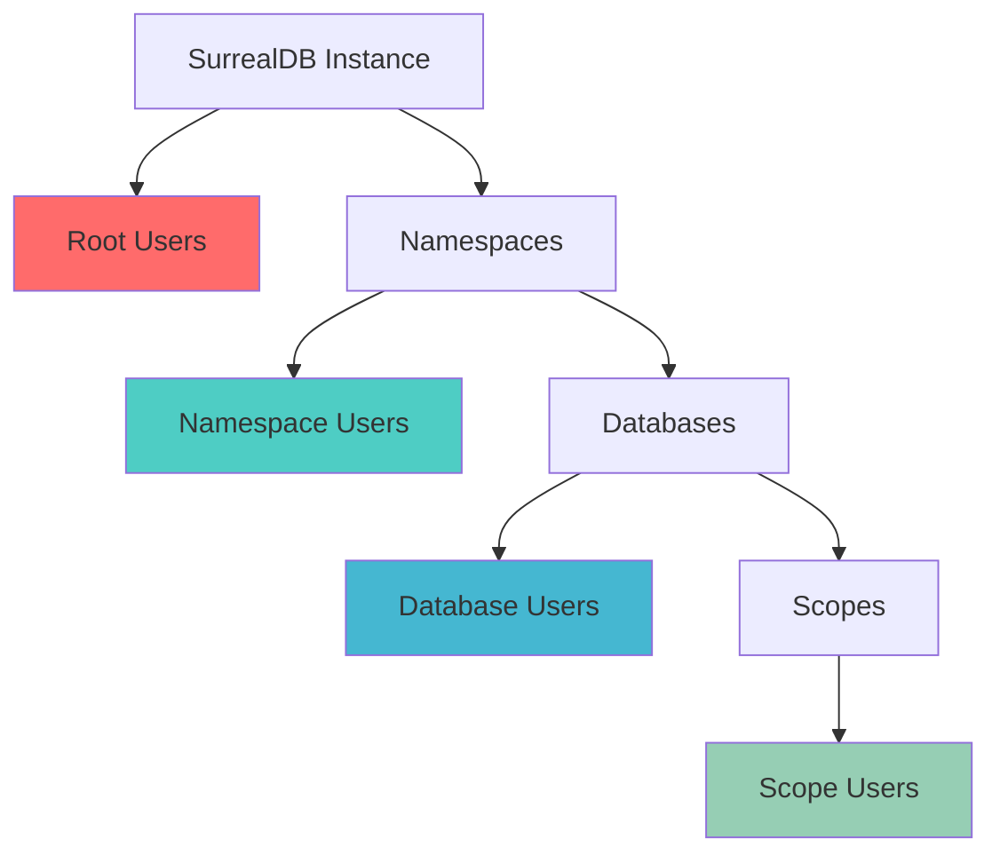

# Authentication Overview

SurrealDB provides multiple authentication methods to secure your applications. This guide introduces the authentication concepts and helps you choose the right method for your use case.

## Authentication Hierarchy

SurrealDB uses a hierarchical authentication system:



### Authentication Levels

| Level | Access | Use Case |
|-------|--------|----------|
| **Root** | Full instance access | System administration |
| **Namespace** | All databases in namespace | Multi-tenant admin |
| **Database** | Single database | Application admin |
| **Scope** | Custom user logic | End users |

## Authentication Methods

### 1. Email and Password

Traditional username/password authentication for different user levels.

```python
# Root user
db.signin({"username": "root", "password": "root"})

# Scope user
db.signin({
    "namespace": "myapp",
    "database": "production", 
    "scope": "user",
    "email": "user@example.com",
    "password": "password123"
})
```

**Best for:** Direct database access, admin users, simple applications

### 2. JWT Token Authentication

Use JSON Web Tokens for stateless authentication.

```python
# Authenticate with existing token
db.authenticate("eyJ0eXAiOiJKV1QiLCJhbGciOiJIUzI1NiJ9...")
```

**Best for:** Microservices, API authentication, token-based systems

### 3. SSO Integration

Single Sign-On with external providers like GitHub, Auth0, etc.

```python
# After OAuth flow
github_token = get_github_token()
surrealdb_token = create_user_from_github(github_token)
db.authenticate(surrealdb_token)
```

**Best for:** Modern web applications, enterprise systems, social login

## Quick Start Guide

### Step 1: Choose Your Authentication Level

Start with the simplest level that meets your needs:

1. **Learning/Development**: Use root authentication
2. **Simple App**: Use scope authentication
3. **Multi-tenant**: Use namespace authentication
4. **Enterprise**: Use SSO integration

### Step 2: Basic Setup

```python
from surrealdb import Surreal

# Connect to SurrealDB
with Surreal("ws://localhost:8000/rpc") as db:
    # Choose your authentication method
    db.signin({"username": "root", "password": "root"})
    
    # Select your workspace
    db.use("myapp", "production")
    
    # Your application logic here
    pass
```

### Step 3: Implement Error Handling

```python
from surrealdb import Surreal

def safe_authentication():
    try:
        with Surreal("ws://localhost:8000/rpc") as db:
            db.signin({"username": "root", "password": "root"})
            db.use("myapp", "production")
            
            # Verify authentication
            user_info = db.info()
            print(f"Authenticated as: {user_info}")
            
            return db
            
    except Exception as e:
        print(f"Authentication failed: {e}")
        raise

# Use safe authentication
db = safe_authentication()
```

## Security Best Practices

### ✅ Do

- **Use environment variables** for credentials
- **Implement proper error handling** for auth failures
- **Use HTTPS/WSS** in production
- **Rotate passwords regularly** for system accounts
- **Use scopes** for end-user authentication
- **Validate JWT tokens** properly
- **Implement session timeouts**

### ❌ Don't

- **Hardcode credentials** in source code
- **Use root credentials** in applications
- **Ignore authentication errors**
- **Store passwords in plain text**
- **Use weak passwords**
- **Skip token validation**
- **Allow unlimited session duration**

## Environment Configuration

Set up your authentication credentials securely:

```bash
# .env file
SURREALDB_URL=ws://localhost:8000/rpc
SURREALDB_USER=root
SURREALDB_PASS=your_secure_password
SURREALDB_NS=myapp
SURREALDB_DB=production
```

```python
import os
from surrealdb import Surreal

# Load from environment
config = {
    "url": os.getenv("SURREALDB_URL"),
    "username": os.getenv("SURREALDB_USER"),
    "password": os.getenv("SURREALDB_PASS"),
    "namespace": os.getenv("SURREALDB_NS"),
    "database": os.getenv("SURREALDB_DB")
}

with Surreal(config["url"]) as db:
    db.signin({
        "username": config["username"],
        "password": config["password"]
    })
    db.use(config["namespace"], config["database"])
```

## Next Steps

Choose your authentication method and dive deeper:

1. **[Basic Authentication](./basic-auth.md)** - Email/password for all user levels
2. **[JWT Authentication](./jwt-auth.md)** - Token-based authentication
3. **[GitHub SSO](./github-sso.md)** - OAuth with GitHub
4. **[Auth0 Integration](./auth0.md)** - Enterprise SSO with Auth0
5. **[Custom Scopes](./custom-scopes.md)** - Advanced user management

## Common Patterns

### Development Pattern

```python
# Simple development setup
with Surreal("ws://localhost:8000/rpc") as db:
    db.signin({"username": "root", "password": "root"})
    db.use("dev", "test")
    # Development code here
```

### Production Pattern

```python
# Production-ready setup
class DatabaseService:
    def __init__(self):
        self.url = os.getenv("SURREALDB_URL")
        self.credentials = {
            "username": os.getenv("SURREALDB_USER"),
            "password": os.getenv("SURREALDB_PASS")
        }
        self.namespace = os.getenv("SURREALDB_NS")
        self.database = os.getenv("SURREALDB_DB")
    
    def get_connection(self):
        db = Surreal(self.url)
        db.signin(self.credentials)
        db.use(self.namespace, self.database)
        return db

# Usage
service = DatabaseService()
with service.get_connection() as db:
    # Production code here
    pass
```

### Microservice Pattern

```python
# JWT-based microservice authentication
class AuthenticatedService:
    def __init__(self, jwt_token):
        self.token = jwt_token
        self.url = os.getenv("SURREALDB_URL")
    
    def execute_operation(self, operation):
        with Surreal(self.url) as db:
            db.authenticate(self.token)
            return operation(db)

# Usage
service = AuthenticatedService(request.headers.get("Authorization"))
result = service.execute_operation(lambda db: db.select("user"))
```

Ready to implement authentication? Start with [Basic Authentication](./basic-auth.md) for simple email/password setup.