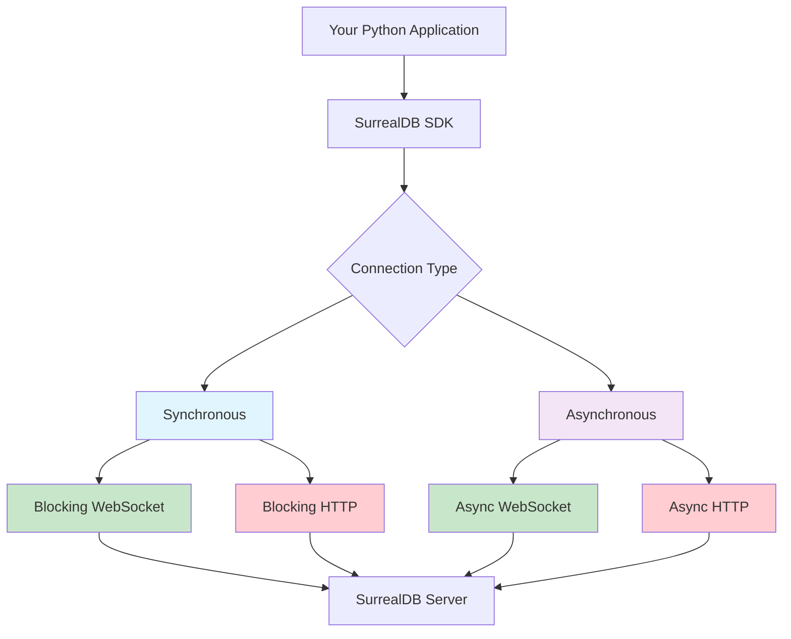

# Connection Types Overview

The SurrealDB Python SDK provides flexible connection options to suit different application architectures and use cases. This guide explains the available connection types and helps you choose the right one for your needs.

## Connection Architecture



## Connection Types Matrix

| Feature | WebSocket | HTTP | Sync | Async |
|---------|-----------|------|------|-------|
| **Real-time queries** | ✅ | ❌ | ✅ | ✅ |
| **Live queries** | ✅ | ❌ | ✅ | ✅ |
| **Persistent connection** | ✅ | ❌ | ✅ | ✅ |
| **Simple request/response** | ✅ | ✅ | ✅ | ✅ |
| **Concurrent operations** | ✅ | ✅ | ❌ | ✅ |
| **Memory efficiency** | Medium | Low | Low | High |
| **Setup complexity** | Medium | Low | Low | Medium |

## Available Connection Classes

### 1. Synchronous Connections

#### `Surreal()` - Auto-detecting Factory

```python
from surrealdb import Surreal

# Automatically chooses connection type based on URL
db = Surreal("ws://localhost:8000/rpc")  # WebSocket
db = Surreal("http://localhost:8000")   # HTTP
```

#### `BlockingWsSurrealConnection` - WebSocket

```python
from surrealdb.connections import BlockingWsSurrealConnection

db = BlockingWsSurrealConnection("ws://localhost:8000/rpc")
```

#### `BlockingHttpSurrealConnection` - HTTP

```python
from surrealdb.connections import BlockingHttpSurrealConnection

db = BlockingHttpSurrealConnection("http://localhost:8000")
```

### 2. Asynchronous Connections

#### `AsyncSurreal()` - Auto-detecting Factory

```python
from surrealdb import AsyncSurreal

# Automatically chooses connection type based on URL
db = AsyncSurreal("ws://localhost:8000/rpc")  # Async WebSocket
db = AsyncSurreal("http://localhost:8000")   # Async HTTP
```

#### `AsyncWsSurrealConnection` - Async WebSocket

```python
from surrealdb.connections import AsyncWsSurrealConnection

db = AsyncWsSurrealConnection("ws://localhost:8000/rpc")
```

#### `AsyncHttpSurrealConnection` - Async HTTP

```python
from surrealdb.connections import AsyncHttpSurrealConnection

db = AsyncHttpSurrealConnection("http://localhost:8000")
```

## Choosing the Right Connection Type

### When to Use WebSocket Connections

**✅ Choose WebSocket when you need:**

- **Real-time features**: Live queries, real-time data synchronization
- **Persistent connections**: Long-running applications with frequent database interactions
- **Bidirectional communication**: Server-initiated notifications
- **Lower latency**: Reduced connection overhead for multiple operations

**📝 Example use cases:**
- Real-time dashboards
- Chat applications
- Live data monitoring
- Gaming applications
- Collaborative tools

```python
from surrealdb import Surreal

# WebSocket for real-time application
with Surreal("ws://localhost:8000/rpc") as db:
    db.signin({"username": "root", "password": "root"})
    db.use("realtime", "dashboard")
    
    # Start live query for real-time updates
    live_id = db.live("metrics")
    
    # Subscribe to live updates
    for update in db.subscribe_live(live_id):
        print(f"Real-time update: {update}")
```

### When to Use HTTP Connections

**✅ Choose HTTP when you need:**

- **Simple request/response**: Traditional API-style interactions
- **Stateless operations**: Each request is independent
- **Load balancing**: Easy to distribute across multiple servers
- **Caching**: HTTP caching mechanisms
- **Firewall friendly**: Standard HTTP ports and protocols

**📝 Example use cases:**
- REST APIs
- Microservices
- Batch processing
- Simple CRUD applications
- Serverless functions

```python
from surrealdb import Surreal

# HTTP for simple API operations
with Surreal("http://localhost:8000") as db:
    db.signin({"username": "root", "password": "root"})
    db.use("api", "users")
    
    # Simple CRUD operations
    user = db.create("user", {"name": "John", "email": "john@example.com"})
    users = db.select("user")
    
    # HTTP connections automatically close after each request
```

### When to Use Synchronous vs Asynchronous

#### Synchronous (Blocking) Connections

**✅ Choose synchronous when:**

- Building simple scripts or tools
- Working with sequential operations
- Learning or prototyping
- Integration with synchronous frameworks

```python
from surrealdb import Surreal

# Synchronous - simple and straightforward
def process_users():
    with Surreal("ws://localhost:8000/rpc") as db:
        db.signin({"username": "root", "password": "root"})
        db.use("app", "users")
        
        # Operations execute one after another
        users = db.select("user")
        for user in users:
            updated = db.merge(user["id"], {"last_seen": "now"})
            print(f"Updated user: {updated}")
```

#### Asynchronous (Non-blocking) Connections

**✅ Choose asynchronous when:**

- Building web applications (FastAPI, Django Async, etc.)
- Handling concurrent operations
- Maximizing performance and scalability
- Working with other async libraries

```python
import asyncio
from surrealdb import AsyncSurreal

# Asynchronous - concurrent operations
async def process_users_async():
    async with AsyncSurreal("ws://localhost:8000/rpc") as db:
        await db.signin({"username": "root", "password": "root"})
        await db.use("app", "users")
        
        # Operations can run concurrently
        users = await db.select("user")
        
        # Process users concurrently
        tasks = [
            db.merge(user["id"], {"last_seen": "now"})
            for user in users
        ]
        
        results = await asyncio.gather(*tasks)
        print(f"Updated {len(results)} users concurrently")

# Run async function
asyncio.run(process_users_async())
```

## Connection URLs and Schemes

### Supported URL Schemes

| Scheme | Protocol | Connection Type | SSL/TLS |
|--------|----------|----------------|---------|
| `ws://` | WebSocket | WebSocket | No |
| `wss://` | WebSocket Secure | WebSocket | Yes |
| `http://` | HTTP | HTTP | No |
| `https://` | HTTPS | HTTP | Yes |

### URL Examples

```python
# Local development
"ws://localhost:8000/rpc"
"http://localhost:8000"

# Production with SSL
"wss://db.mycompany.com/rpc"
"https://api.mycompany.com"

# Custom ports
"ws://localhost:9000/rpc"
"http://192.168.1.100:8080"

# SurrealDB Cloud
"wss://cloud.surrealdb.com/rpc"
```

## Connection Lifecycle

### Manual Connection Management

```python
from surrealdb import Surreal

# Manual connection management
db = Surreal("ws://localhost:8000/rpc")

try:
    # Connect and authenticate
    db.signin({"username": "root", "password": "root"})
    db.use("myapp", "production")
    
    # Your database operations
    result = db.query("SELECT * FROM user")
    
finally:
    # Always close the connection
    db.close()
```

### Context Manager (Recommended)

```python
from surrealdb import Surreal

# Automatic connection management
with Surreal("ws://localhost:8000/rpc") as db:
    db.signin({"username": "root", "password": "root"})
    db.use("myapp", "production")
    
    # Your database operations
    result = db.query("SELECT * FROM user")
    
# Connection automatically closed when exiting context
```

### Async Context Manager

```python
import asyncio
from surrealdb import AsyncSurreal

async def main():
    # Automatic async connection management
    async with AsyncSurreal("ws://localhost:8000/rpc") as db:
        await db.signin({"username": "root", "password": "root"})
        await db.use("myapp", "production")
        
        # Your async database operations
        result = await db.query("SELECT * FROM user")
        
    # Connection automatically closed when exiting context

asyncio.run(main())
```

## Connection Configuration

### Basic Configuration

```python
from surrealdb import Surreal

# Basic connection
db = Surreal("ws://localhost:8000/rpc")
```

### Advanced Configuration

```python
import os
from surrealdb import Surreal

# Environment-based configuration
config = {
    "url": os.getenv("SURREALDB_URL", "ws://localhost:8000/rpc"),
    "username": os.getenv("SURREALDB_USER", "root"),
    "password": os.getenv("SURREALDB_PASS", "root"),
    "namespace": os.getenv("SURREALDB_NS", "production"),
    "database": os.getenv("SURREALDB_DB", "myapp")
}

with Surreal(config["url"]) as db:
    db.signin({
        "username": config["username"],
        "password": config["password"]
    })
    db.use(config["namespace"], config["database"])
    
    # Your application logic
```

## Performance Considerations

### Connection Pooling

For high-throughput applications, consider implementing connection pooling:

```python
import threading
from queue import Queue
from surrealdb import Surreal

class ConnectionPool:
    def __init__(self, url, size=10):
        self.url = url
        self.pool = Queue(maxsize=size)
        self.lock = threading.Lock()
        
        # Pre-create connections
        for _ in range(size):
            conn = self._create_connection()
            self.pool.put(conn)
    
    def _create_connection(self):
        db = Surreal(self.url)
        db.signin({"username": "root", "password": "root"})
        db.use("myapp", "production")
        return db
    
    def get_connection(self):
        return self.pool.get()
    
    def return_connection(self, conn):
        self.pool.put(conn)

# Usage
pool = ConnectionPool("ws://localhost:8000/rpc")

conn = pool.get_connection()
try:
    result = conn.query("SELECT * FROM user")
finally:
    pool.return_connection(conn)
```

### Connection Reuse

```python
from surrealdb import Surreal

class DatabaseService:
    def __init__(self, url):
        self.db = Surreal(url)
        self.db.signin({"username": "root", "password": "root"})
        self.db.use("myapp", "production")
    
    def get_users(self):
        return self.db.select("user")
    
    def create_user(self, data):
        return self.db.create("user", data)
    
    def close(self):
        self.db.close()

# Single connection for multiple operations
service = DatabaseService("ws://localhost:8000/rpc")
try:
    users = service.get_users()
    new_user = service.create_user({"name": "John"})
finally:
    service.close()
```

## Next Steps

Now that you understand the connection types:

1. **[WebSocket Connections](./websocket.md)** - Deep dive into WebSocket features
2. **[HTTP Connections](./http.md)** - Learn about HTTP connection specifics
3. **[Async vs Sync](./async-vs-sync.md)** - Detailed comparison and use cases
4. **[Authentication Methods](../methods/authentication.md)** - Secure your connections

## Best Practices

### ✅ Do

- Use context managers for automatic connection cleanup
- Choose WebSocket for real-time features
- Use async connections for concurrent applications
- Implement proper error handling
- Use environment variables for configuration

### ❌ Don't

- Leave connections open without cleanup
- Use blocking connections in async applications
- Hardcode credentials in source code
- Mix sync and async code without proper handling
- Ignore connection errors

---

**Need help choosing?** Check our [decision flowchart](./decision-guide.md) or join our [Discord community](https://surrealdb.com/discord).