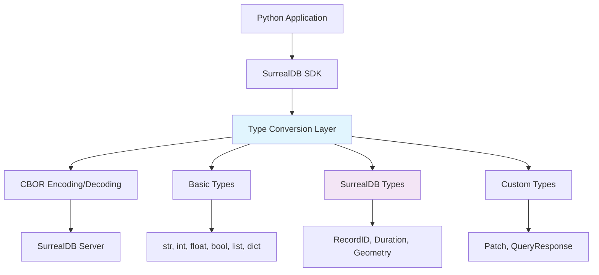

# SurrealDB Python SDK Data Types

The SurrealDB Python SDK provides robust support for all SurrealDB data types, enabling seamless integration between Python applications and SurrealDB. This comprehensive guide covers all available data types, their usage patterns, and best practices for effective implementation.

## Introduction to SurrealDB Data Types

SurrealDB offers a rich type system that extends beyond traditional SQL databases, providing specialized types for various data scenarios. The Python SDK implements these types as native Python classes, ensuring type safety and proper serialization/deserialization when communicating with the database.

### Type System Architecture



### Type Mapping Overview

| SurrealDB Type | Python SDK Class | Python Equivalent | Description |
|----------------|------------------|-------------------|-------------|
| **Record ID** | `RecordID` | N/A | Unique record identifiers |
| **Table** | `Table` | N/A | Table references |
| **Duration** | `Duration` | `timedelta` | Time intervals |
| **DateTime** | `IsoDateTimeWrapper` | `datetime` | Date and time values |
| **Geometry** | `GeometryPoint`, etc. | N/A | Spatial data types |
| **Range** | `Range` | N/A | Bounded ranges |
| **Future** | `Future` | N/A | Deferred computations |
| **String** | N/A | `str` | Text data |
| **Number** | N/A | `int`, `float`, `Decimal` | Numeric values |
| **Boolean** | N/A | `bool` | True/false values |
| **None** | N/A | `None` | Null values |
| **Array** | N/A | `list` | Ordered collections |
| **Object** | N/A | `dict` | Key-value pairs |

## RecordID

The `RecordID` class represents unique identifiers for database records, combining a table name with a specific record identifier.

### Overview

A Record ID in SurrealDB has the format `table:identifier`, where:
- **table**: The name of the table containing the record
- **identifier**: A unique identifier within that table (string, number, or complex type)

### Constructor

```python
from surrealdb.data.types.record_id import RecordID

# Create a RecordID
record_id = RecordID(table_name="users", identifier="john_doe")
print(record_id)  # Output: users:john_doe
```

### Key Methods

| Method | Description | Example |
|--------|-------------|---------|
| `__init__(table_name, identifier)` | Constructor | `RecordID("users", "john_doe")` |
| `parse(string)` | Parse from string | `RecordID.parse("users:john_doe")` |
| `__str__()` | String representation | `str(record_id)` → `"users:john_doe"` |

### Common Operations

```python
# Creating RecordIDs
user_id = RecordID("users", "john_doe")
product_id = RecordID("products", "SKU-12345")
numeric_id = RecordID("items", 12345)

# Parsing from string
parsed_id = RecordID.parse("users:jane_smith")
print(f"Table: {parsed_id.table_name}, ID: {parsed_id.id}")

# Using in database operations
user = await db.select(user_id)
```

### Real-World Example: User Management System

```python
from surrealdb.data.types.record_id import RecordID

# Creating RecordIDs for a user management system
user_id = RecordID("users", "john_doe_123")
admin_id = RecordID("users", "admin_001")
profile_id = RecordID("profiles", "profile_456")

# Using RecordID in database operations
async def get_user_profile(db, user_record_id: RecordID):
    """Fetch user profile using RecordID"""
    result = await db.select(user_record_id)
    return result

# Creating relationships between records
order_data = {
    "customer": RecordID("customers", "CUST_001"),
    "products": [
        RecordID("products", "PROD_LAPTOP"),
        RecordID("products", "PROD_MOUSE")
    ],
    "status": "pending"
}
```

## Table

The `Table` class represents a database table by its name, useful for dynamic table operations.

### Constructor

```python
from surrealdb.data.types.table import Table

# Create a Table reference
users_table = Table("users")
print(users_table)  # Output: users
```

### Key Methods

| Method | Description | Example |
|--------|-------------|---------|
| `__init__(table_name)` | Constructor | `Table("users")` |
| `__str__()` | String representation | `str(users_table)` → `"users"` |

### Common Operations

```python
# Creating Table references
users_table = Table("users")
orders_table = Table("orders")

# Using in dynamic operations
table_name = "users"
dynamic_table = Table(table_name)
```

### Real-World Example: Multi-tenant Application

```python
from surrealdb.data.types.table import Table

class MultiTenantManager:
    def __init__(self):
        self.tenant_tables = {}
    
    def get_tenant_table(self, tenant_id: str, base_table: str) -> Table:
        """Generate tenant-specific table names"""
        tenant_table_name = f"{tenant_id}_{base_table}"
        return Table(tenant_table_name)
    
    def setup_tenant_tables(self, tenant_id: str):
        """Setup all required tables for a tenant"""
        base_tables = ["users", "orders", "products", "invoices"]
        tenant_tables = {}
        
        for base_table in base_tables:
            tenant_table = self.get_tenant_table(tenant_id, base_table)
            tenant_tables[base_table] = tenant_table
        
        self.tenant_tables[tenant_id] = tenant_tables
        return tenant_tables

# Usage
tenant_manager = MultiTenantManager()
company_a_tables = tenant_manager.setup_tenant_tables("company_a")
company_b_tables = tenant_manager.setup_tenant_tables("company_b")

# Access tenant-specific tables
users_table_a = company_a_tables["users"]  # company_a_users
users_table_b = company_b_tables["users"]  # company_b_users
```

## Duration

The `Duration` class represents time intervals with nanosecond precision, supporting various time units.

### Constructor

```python
from surrealdb.data.types.duration import Duration

# Create a Duration
one_hour = Duration.parse("1h")
two_minutes = Duration.parse("2m")
complex_duration = Duration.parse("1h30m15s")
```

### Key Methods

| Method | Description | Example |
|--------|-------------|---------|
| `__init__(nanoseconds)` | Constructor | `Duration(3600000000000)` |
| `parse(string)` | Parse from string | `Duration.parse("1h30m")` |
| `to_string()` | String representation | `duration.to_string()` → `"1h30m"` |
| `seconds` | Get seconds | `duration.seconds` → `5400` |

### Common Operations

```python
# Creating Durations
minute = Duration.parse("1m")
hour = Duration.parse("1h")
day = Duration.parse("1d")
complex_time = Duration.parse("2h30m45s")

# From seconds
timeout = Duration.parse("30s")
print(f"Timeout in seconds: {timeout.seconds}")

# String representation
print(f"Duration: {complex_time.to_string()}")
```

### Real-World Example: Performance Monitoring System

```python
from surrealdb.data.types.duration import Duration
import time

class PerformanceMonitor:
    def __init__(self):
        self.metrics = {}
        self.thresholds = {}
    
    def set_threshold(self, operation: str, threshold_str: str):
        """Set performance threshold for an operation"""
        self.thresholds[operation] = Duration.parse(threshold_str)
    
    def record_operation(self, operation: str, duration: Duration):
        """Record operation duration"""
        if operation not in self.metrics:
            self.metrics[operation] = []
        self.metrics[operation].append(duration)
    
    def check_threshold_violation(self, operation: str, duration: Duration) -> bool:
        """Check if operation exceeded threshold"""
        threshold = self.thresholds.get(operation)
        if threshold:
            return duration.elapsed > threshold.elapsed
        return False
    
    def get_average_duration(self, operation: str) -> Duration:
        """Calculate average duration for an operation"""
        durations = self.metrics.get(operation, [])
        if not durations:
            return Duration(0)
        
        total_elapsed = sum(d.elapsed for d in durations)
        avg_elapsed = total_elapsed // len(durations)
        return Duration(avg_elapsed)

# Usage
monitor = PerformanceMonitor()

# Set thresholds
monitor.set_threshold("database_query", "100ms")
monitor.set_threshold("api_request", "500ms")

# Record operations
monitor.record_operation("database_query", Duration.parse("50ms"))
monitor.record_operation("database_query", Duration.parse("120ms"))  # Exceeds threshold

# Get average duration
avg_duration = monitor.get_average_duration("database_query")
print(f"Average query time: {avg_duration.to_string()}")
```

## DateTime

The `IsoDateTimeWrapper` class handles ISO 8601 datetime strings for database operations.

### Constructor

```python
from surrealdb.data.types.datetime import IsoDateTimeWrapper
from datetime import datetime, timezone

# Create a DateTime wrapper
now = datetime.now(timezone.utc)
dt_wrapper = IsoDateTimeWrapper(now.isoformat())
```

### Key Methods

| Method | Description | Example |
|--------|-------------|---------|
| `__init__(iso_string)` | Constructor | `IsoDateTimeWrapper("2023-01-01T12:00:00Z")` |
| `dt` | Access datetime | `dt_wrapper.dt` → ISO datetime string |

### Common Operations

```python
# Creating DateTime wrappers
from datetime import datetime, timezone
from surrealdb.data.types.datetime import IsoDateTimeWrapper

# From datetime object
now = datetime.now(timezone.utc)
dt_wrapper = IsoDateTimeWrapper(now.isoformat())

# From ISO string
iso_string = "2023-06-15T14:30:00Z"
dt_wrapper2 = IsoDateTimeWrapper(iso_string)

# Accessing the datetime string
print(f"DateTime: {dt_wrapper.dt}")
```

### Real-World Example: Event Management System

```python
from surrealdb.data.types.datetime import IsoDateTimeWrapper
from datetime import datetime, timezone, timedelta

class EventManager:
    def __init__(self):
        self.events = {}
    
    def create_event(self, event_id: str, title: str, start_time: datetime, 
                    duration_hours: int = 1, timezone_name: str = "UTC"):
        """Create an event with datetime handling"""
        # Ensure datetime is timezone-aware
        if start_time.tzinfo is None:
            start_time = start_time.replace(tzinfo=timezone.utc)
        
        end_time = start_time + timedelta(hours=duration_hours)
        
        # Convert to ISO format for SurrealDB
        start_iso = IsoDateTimeWrapper(start_time.isoformat())
        end_iso = IsoDateTimeWrapper(end_time.isoformat())
        created_iso = IsoDateTimeWrapper(datetime.now(timezone.utc).isoformat())
        
        event_data = {
            "id": event_id,
            "title": title,
            "start_time": start_iso,
            "end_time": end_iso,
            "created_at": created_iso,
            "timezone": timezone_name,
            "duration_hours": duration_hours
        }
        
        self.events[event_id] = event_data
        return event_data

# Usage
event_manager = EventManager()

# Create events with different timezones
utc_time = datetime(2024, 6, 15, 14, 30, 0, tzinfo=timezone.utc)
meeting_event = event_manager.create_event(
    "meeting_001", 
    "Team Standup", 
    utc_time, 
    duration_hours=1
)

print(f"Event start: {meeting_event['start_time'].dt}")
print(f"Event end: {meeting_event['end_time'].dt}")
```

## Geometry

The geometry classes represent spatial data types for geographic information.

### Available Geometry Types

| Class | Description | Example |
|-------|-------------|---------|
| `GeometryPoint` | Single point | `GeometryPoint(-122.4194, 37.7749)` |
| `GeometryLine` | Line or path | `GeometryLine(point1, point2, point3)` |
| `GeometryPolygon` | Enclosed area | `GeometryPolygon(boundary_line)` |
| `GeometryMultiPoint` | Collection of points | `GeometryMultiPoint(point1, point2)` |
| `GeometryMultiLine` | Collection of lines | `GeometryMultiLine(line1, line2)` |
| `GeometryMultiPolygon` | Collection of polygons | `GeometryMultiPolygon(polygon1, polygon2)` |
| `GeometryCollection` | Mixed geometry collection | `GeometryCollection(point, line, polygon)` |

### Constructor Examples

```python
from surrealdb.data.types.geometry import (
    GeometryPoint, GeometryLine, GeometryPolygon,
    GeometryMultiPoint, GeometryMultiLine, GeometryMultiPolygon,
    GeometryCollection
)

# Create a point (longitude, latitude)
sf_point = GeometryPoint(-122.4194, 37.7749)  # San Francisco

# Create a line
route = GeometryLine(
    GeometryPoint(-122.4194, 37.7749),  # San Francisco
    GeometryPoint(-118.2437, 34.0522),  # Los Angeles
    GeometryPoint(-115.1398, 36.1699)   # Las Vegas
)

# Create a polygon
area = GeometryPolygon(
    GeometryLine(
        GeometryPoint(-122.4, 37.7),
        GeometryPoint(-122.4, 37.8),
        GeometryPoint(-122.5, 37.8),
        GeometryPoint(-122.5, 37.7),
        GeometryPoint(-122.4, 37.7)  # Close the polygon
    )
)
```

### Key Methods

| Method | Description | Example |
|--------|-------------|---------|
| `get_coordinates()` | Get coordinates | `point.get_coordinates()` → `(-122.4194, 37.7749)` |
| `longitude`, `latitude` | Access point coordinates | `point.longitude`, `point.latitude` |

### Real-World Example: Location-Based Service

```python
from surrealdb.data.types.geometry import GeometryPoint, GeometryPolygon, GeometryLine
import math

class LocationService:
    def __init__(self):
        self.locations = {}
        self.service_areas = {}
    
    def add_location(self, name: str, longitude: float, latitude: float):
        """Add a point of interest"""
        point = GeometryPoint(longitude, latitude)
        self.locations[name] = point
        return point
    
    def add_service_area(self, name: str, boundary_points: list):
        """Add a service area polygon"""
        # Convert points to GeometryPoints
        geo_points = [GeometryPoint(lon, lat) for lon, lat in boundary_points]
        
        # Create a closed boundary line
        boundary = GeometryLine(*geo_points)
        
        # Create polygon
        area = GeometryPolygon(boundary)
        self.service_areas[name] = area
        return area
    
    def is_point_in_area(self, point: GeometryPoint, area_name: str) -> bool:
        """Check if a point is within a service area"""
        if area_name not in self.service_areas:
            return False
        
        # This is a simplified check - in production use proper geospatial libraries
        area = self.service_areas[area_name]
        # Implementation of point-in-polygon algorithm would go here
        return True  # Placeholder
    
    def calculate_distance(self, point1: GeometryPoint, point2: GeometryPoint) -> float:
        """Calculate distance between two points in kilometers"""
        # Haversine formula
        R = 6371  # Earth's radius in kilometers
        
        lat1, lon1 = point1.latitude, point1.longitude
        lat2, lon2 = point2.latitude, point2.longitude
        
        dlat = math.radians(lat2 - lat1)
        dlon = math.radians(lon2 - lon1)
        
        a = (math.sin(dlat/2) * math.sin(dlat/2) + 
             math.cos(math.radians(lat1)) * math.cos(math.radians(lat2)) * 
             math.sin(dlon/2) * math.sin(dlon/2))
        c = 2 * math.atan2(math.sqrt(a), math.sqrt(1-a))
        
        return R * c

# Usage
location_service = LocationService()

# Add locations
sf = location_service.add_location("San Francisco", -122.4194, 37.7749)
la = location_service.add_location("Los Angeles", -118.2437, 34.0522)

# Calculate distance
distance = location_service.calculate_distance(sf, la)
print(f"Distance between SF and LA: {distance:.2f} km")
```

## Range

The range classes represent bounded ranges with inclusive and exclusive bounds.

### Constructor

```python
from surrealdb.data.types.range import Range, BoundIncluded, BoundExcluded

# Create a numeric range (10 to 20, inclusive)
num_range = Range(BoundIncluded(10), BoundIncluded(20))

# Create a range with exclusive upper bound
range_ex = Range(BoundIncluded(0), BoundExcluded(100))
```

### Key Components

| Class | Description | Example |
|-------|-------------|---------|
| `Range` | Range container | `Range(begin, end)` |
| `BoundIncluded` | Inclusive bound | `BoundIncluded(10)` |
| `BoundExcluded` | Exclusive bound | `BoundExcluded(20)` |

### Common Operations

```python
from surrealdb.data.types.range import Range, BoundIncluded, BoundExcluded
from datetime import date

# Numeric ranges
price_range = Range(BoundIncluded(10.0), BoundIncluded(50.0))

# Date ranges
date_range = Range(
    BoundIncluded(date(2023, 1, 1)),
    BoundExcluded(date(2024, 1, 1))  # Up to but not including 2024
)
```

### Real-World Example: Data Validation System

```python
from surrealdb.data.types.range import Range, BoundIncluded, BoundExcluded
from datetime import date
from typing import Any, Union

class DataValidator:
    def __init__(self):
        self.validation_rules = {}
    
    def add_numeric_range_rule(self, field_name: str, min_value: float, max_value: float,
                              min_inclusive: bool = True, max_inclusive: bool = True):
        """Add numeric range validation rule"""
        min_bound = BoundIncluded(min_value) if min_inclusive else BoundExcluded(min_value)
        max_bound = BoundIncluded(max_value) if max_inclusive else BoundExcluded(max_value)
        
        self.validation_rules[field_name] = {
            "type": "numeric_range",
            "range": Range(min_bound, max_bound),
            "description": f"Value must be between {min_value} and {max_value}"
        }
    
    def add_date_range_rule(self, field_name: str, start_date: date, end_date: date,
                           start_inclusive: bool = True, end_inclusive: bool = True):
        """Add date range validation rule"""
        start_bound = BoundIncluded(start_date) if start_inclusive else BoundExcluded(start_date)
        end_bound = BoundIncluded(end_date) if end_inclusive else BoundExcluded(end_date)
        
        self.validation_rules[field_name] = {
            "type": "date_range",
            "range": Range(start_bound, end_bound),
            "description": f"Date must be between {start_date} and {end_date}"
        }
    
    def validate_value(self, field_name: str, value: Any) -> dict:
        """Validate a value against its range rule"""
        if field_name not in self.validation_rules:
            return {"valid": True, "message": "No validation rule defined"}
        
        rule = self.validation_rules[field_name]
        range_obj = rule["range"]
        
        # Check bounds
        valid = True
        messages = []
        
        # Check lower bound
        if isinstance(range_obj.begin, BoundIncluded):
            if value < range_obj.begin.value:
                valid = False
                messages.append(f"Value {value} is below minimum {range_obj.begin.value}")
        elif isinstance(range_obj.begin, BoundExcluded):
            if value <= range_obj.begin.value:
                valid = False
                messages.append(f"Value {value} must be greater than {range_obj.begin.value}")
        
        # Check upper bound
        if isinstance(range_obj.end, BoundIncluded):
            if value > range_obj.end.value:
                valid = False
                messages.append(f"Value {value} is above maximum {range_obj.end.value}")
        elif isinstance(range_obj.end, BoundExcluded):
            if value >= range_obj.end.value:
                valid = False
                messages.append(f"Value {value} must be less than {range_obj.end.value}")
        
        return {
            "valid": valid,
            "messages": messages,
            "rule_description": rule["description"]
        }

# Usage
validator = DataValidator()

# Add validation rules
validator.add_numeric_range_rule("age", 0, 120, min_inclusive=True, max_inclusive=True)
validator.add_numeric_range_rule("temperature", -273.15, 1000.0, min_inclusive=False, max_inclusive=True)

# Add date range rules
validator.add_date_range_rule("birth_date", 
                             date(1900, 1, 1), 
                             date.today(), 
                             start_inclusive=True, 
                             end_inclusive=True)

# Test validation
age_result = validator.validate_value("age", 25)
temp_result = validator.validate_value("temperature", -273.15)  # Should fail (exclusive bound)

print(f"Age validation: {age_result['valid']}")
print(f"Temperature validation: {temp_result['valid']}")
if not temp_result['valid']:
    print(f"Error: {temp_result['messages'][0]}")
```

## Future

The `Future` class represents a placeholder for values that may be resolved later.

### Constructor

```python
from surrealdb.data.types.future import Future

# Create a Future
future = Future(None)  # Initially unresolved
future.value = "resolved value"  # Resolve later
```

### Key Methods

| Method | Description | Example |
|--------|-------------|---------|
| `__init__(value=None)` | Constructor | `Future(None)` |
| `value` | Access or set value | `future.value = result` |

### Common Operations

```python
from surrealdb.data.types.future import Future

# Create an unresolved Future
future = Future(None)

# Check if resolved
is_resolved = future.value is not None
print(f"Is resolved: {is_resolved}")  # False

# Resolve the Future
future.value = "Completed result"
print(f"Value: {future.value}")
print(f"Is resolved: {future.value is not None}")  # True
```

### Real-World Example: Asynchronous Task Management

```python
from surrealdb.data.types.future import Future
from datetime import datetime
from typing import Any, Dict, List, Optional, Callable
import asyncio
import uuid

class TaskManager:
    def __init__(self):
        self.tasks: Dict[str, Dict[str, Any]] = {}
        self.futures: Dict[str, Future] = {}
        self.completed_tasks: Dict[str, Any] = {}
    
    def create_task(self, task_name: str, task_function: Callable = None, 
                   dependencies: List[str] = None) -> str:
        """Create a new task and return its ID"""
        task_id = str(uuid.uuid4())
        
        # Create a Future to hold the eventual result
        task_future = Future(None)  # Initially unresolved
        
        task_data = {
            "id": task_id,
            "name": task_name,
            "function": task_function,
            "dependencies": dependencies or [],
            "status": "pending",
            "created_at": datetime.now(),
            "started_at": None,
            "completed_at": None,
            "result_future": task_future,
            "error": None
        }
        
        self.tasks[task_id] = task_data
        self.futures[task_id] = task_future
        
        return task_id
    
    def create_dependent_task(self, task_name: str, dependency_ids: List[str], 
                            combiner_function: Callable = None) -> str:
        """Create a task that depends on other tasks' results"""
        def dependency_combiner():
            # Get results from dependency futures
            dependency_results = []
            for dep_id in dependency_ids:
                if dep_id in self.futures:
                    dep_future = self.futures[dep_id]
                    if dep_future.value is not None:
                        dependency_results.append(dep_future.value)
                    else:
                        raise ValueError(f"Dependency {dep_id} not yet resolved")
            
            # Apply combiner function if provided
            if combiner_function:
                return combiner_function(dependency_results)
            else:
                return dependency_results
        
        return self.create_task(task_name, dependency_combiner, dependency_ids)
    
    def resolve_task(self, task_id: str, result: Any):
        """Resolve a task with its result"""
        if task_id not in self.tasks:
            raise ValueError(f"Task {task_id} not found")
        
        task = self.tasks[task_id]
        task["status"] = "completed"
        task["completed_at"] = datetime.now()
        
        # Update the Future with the result
        task["result_future"].value = result
        self.futures[task_id].value = result
        
        # Move to completed tasks
        self.completed_tasks[task_id] = task

# Usage
task_manager = TaskManager()

# Create independent tasks
data_fetch_task = task_manager.create_task("fetch_user_data")
config_load_task = task_manager.create_task("load_configuration")

# Create dependent task
def combine_user_and_config(results):
    """Combine user data and configuration"""
    user_data, config = results
    return {
        "user": user_data,
        "config": config,
        "combined_at": datetime.now()
    }

setup_task = task_manager.create_dependent_task(
    "setup_user_environment",
    [data_fetch_task, config_load_task],
    combine_user_and_config
)

# Resolve tasks
task_manager.resolve_task(data_fetch_task, {
    "user_id": "user_123",
    "name": "John Doe",
    "email": "john@example.com"
})

task_manager.resolve_task(config_load_task, {
    "theme": "dark",
    "language": "en",
    "timezone": "UTC"
})

# The dependent task can now be executed
```

## Integration with Pydantic

Pydantic provides robust validation and serialization for SurrealDB data types, enabling type-safe database operations.

### Base Model with SurrealDB Integration

```python
from pydantic import BaseModel, Field, validator
from typing import Optional, List
from surrealdb.data.types.record_id import RecordID
from surrealdb.data.types.geometry import GeometryPoint
from surrealdb.data.types.duration import Duration

class SurrealDBModel(BaseModel):
    """Base model for SurrealDB integration with common functionality."""
    
    class Config:
        # Allow arbitrary types for SurrealDB custom types
        arbitrary_types_allowed = True
        # Use enum values for serialization
        use_enum_values = True
        # Validate assignment
        validate_assignment = True
        # JSON encoders for SurrealDB types
        json_encoders = {
            RecordID: lambda v: str(v),
            Duration: lambda v: v.to_string(),
            GeometryPoint: lambda v: {"type": "Point", "coordinates": list(v.get_coordinates())},
        }
    
    @classmethod
    def from_surrealdb(cls, data: dict):
        """Create model instance from SurrealDB response data."""
        return cls(**data)
    
    def to_surrealdb(self) -> dict:
        """Convert model to dictionary suitable for SurrealDB operations."""
        return self.dict(exclude_none=True)
```

### Example: User Model with RecordID and Validation

```python
from enum import Enum
from datetime import datetime, timezone
from pydantic import constr, validator
from typing import Optional

class UserRole(str, Enum):
    ADMIN = "admin"
    USER = "user"
    MODERATOR = "moderator"

class User(SurrealDBModel):
    """User model with RecordID and comprehensive validation."""
    
    id: Optional[RecordID] = None
    username: constr(min_length=3, max_length=50, regex=r'^[a-zA-Z0-9_]+$')
    email: constr(regex=r'^[a-zA-Z0-9._%+-]+@[a-zA-Z0-9.-]+\.[a-zA-Z]{2,}$')
    full_name: constr(min_length=1, max_length=100)
    role: UserRole = UserRole.USER
    created_at: datetime = Field(default_factory=lambda: datetime.now(timezone.utc))
    updated_at: Optional[datetime] = None
    location: Optional[GeometryPoint] = None
    session_timeout: Duration = Field(default_factory=lambda: Duration.parse("1h"))
    
    @validator('id', pre=True, always=True)
    def validate_record_id(cls, v, values):
        """Validate and create RecordID if needed."""
        if v is None:
            username = values.get('username')
            if username:
                return RecordID("users", username)
        elif isinstance(v, str):
            return RecordID.parse(v)
        return v
    
    @validator('location', pre=True)
    def validate_location(cls, v):
        """Validate and convert location data."""
        if v is None:
            return v
        if isinstance(v, dict) and 'coordinates' in v:
            coords = v['coordinates']
            return GeometryPoint(coords[0], coords[1])
        elif isinstance(v, (list, tuple)) and len(v) == 2:
            return GeometryPoint(v[0], v[1])
        return v
    
    @validator('session_timeout', pre=True)
    def validate_session_timeout(cls, v):
        """Validate and convert session timeout."""
        if isinstance(v, str):
            return Duration.parse(v)
        elif isinstance(v, int):
            return Duration.parse(f"{v}s")
        return v
```

### Example: Location Model with Geometry Types

```python
from pydantic import constr, confloat, validator
from typing import Optional, Union, Dict

class LocationType(str, Enum):
    POINT_OF_INTEREST = "poi"
    RESTAURANT = "restaurant"
    STORE = "store"
    OFFICE = "office"

class Location(SurrealDBModel):
    """Location model with geometry support."""
    
    id: Optional[RecordID] = None
    name: constr(min_length=1, max_length=200)
    location_type: LocationType
    address: str
    coordinates: GeometryPoint
    service_area: Optional[Union[GeometryPolygon, GeometryMultiPolygon]] = None
    operating_hours: Dict[str, str] = Field(default_factory=dict)
    rating: Optional[confloat(ge=0, le=5)] = None
    created_at: datetime = Field(default_factory=lambda: datetime.now(timezone.utc))
    
    @validator('id', pre=True, always=True)
    def validate_record_id(cls, v, values):
        """Generate RecordID from name if not provided."""
        if v is None:
            name = values.get('name')
            if name:
                # Create a slug from name
                slug = name.lower().replace(' ', '_').replace('-', '_')
                return RecordID("locations", slug)
        elif isinstance(v, str):
            return RecordID.parse(v)
        return v
    
    @validator('coordinates', pre=True)
    def validate_coordinates(cls, v):
        """Validate and convert coordinates."""
        if isinstance(v, dict) and 'coordinates' in v:
            coords = v['coordinates']
            return GeometryPoint(coords[0], coords[1])
        elif isinstance(v, (list, tuple)) and len(v) == 2:
            return GeometryPoint(v[0], v[1])
        elif isinstance(v, GeometryPoint):
            return v
        else:
            raise ValueError("Coordinates must be a GeometryPoint, dict with coordinates, or [lon, lat] array")
```

## Type Conversion and Serialization

SurrealDB Python SDK handles type conversion between Python types and SurrealDB types automatically.

### Python to SurrealDB Conversion

| Python Type | SurrealDB Type | Notes |
|-------------|----------------|-------|
| `str` | String | Direct mapping |
| `int` | Number | Direct mapping |
| `float` | Number | Direct mapping |
| `bool` | Boolean | Direct mapping |
| `None` | None | Direct mapping |
| `list` | Array | Recursive conversion |
| `dict` | Object | Recursive conversion |
| `datetime` | DateTime | Automatic conversion |
| `timedelta` | Duration | Use `Duration.parse()` |
| `Decimal` | Number | Precision preserved |
| `RecordID` | Record ID | Proper serialization |
| `GeometryPoint` etc. | Geometry | Proper serialization |

### SurrealDB to Python Conversion

When retrieving data from SurrealDB, the SDK automatically converts SurrealDB types to appropriate Python types or SDK classes:

```python
from surrealdb import Surreal
from surrealdb.data.types import RecordID, GeometryPoint, Duration

async def type_conversion_example():
    db = Surreal("ws://localhost:8000/rpc")
    await db.connect()
    await db.signin({"username": "root", "password": "root"})
    await db.use("test", "test")
    
    # Create record with mixed types
    created = await db.create("location", {
        "name": "Office",
        "coordinates": GeometryPoint(-122.4194, 37.7749),
        "manager": RecordID("user", "john"),
        "hours": Duration.parse("8h")
    })
    
    # Retrieve and examine types
    locations = await db.select("location")
    
    for location in locations:
        print(f"Location ID: {location['id']} (type: {type(location['id'])})")
        print(f"Name: {location['name']} (type: {type(location['name'])})")
        print(f"Coordinates: {location['coordinates']} (type: {type(location['coordinates'])})")
        print(f"Manager: {location['manager']} (type: {type(location['manager'])})")
        print(f"Hours: {location['hours']} (type: {type(location['hours'])})")
```

## Best Practices

### Type Safety

1. **Use SDK Types**: Always use the appropriate SDK types for SurrealDB-specific data
2. **Validate Before Operations**: Validate types before database operations
3. **Handle Conversions Explicitly**: For complex types, handle conversions explicitly
4. **Use Pydantic**: Leverage Pydantic for comprehensive type validation

### Performance Considerations

1. **Batch Operations**: Use batch operations for consistent type handling
2. **Efficient Queries**: Write efficient queries that leverage SurrealDB's type system
3. **Minimize Conversions**: Minimize unnecessary type conversions
4. **Caching**: Consider caching for frequently accessed data

### Error Handling

1. **Graceful Handling**: Handle type errors gracefully
2. **Validation First**: Validate data before sending to the database
3. **Proper Exceptions**: Use proper exception handling for type-related errors
4. **Logging**: Log type conversion issues for debugging

## Troubleshooting Common Issues

### Issue: RecordID Parsing Errors

**Problem**: `ValueError: invalid string provided for parse`

**Solution**: Ensure the string format is `table:identifier` with no spaces.

```python
# Correct
record_id = RecordID.parse("users:john_doe")

# Incorrect - will raise ValueError
# record_id = RecordID.parse("users: john_doe")
# record_id = RecordID.parse("users-john_doe")
```

### Issue: Geometry Type Conversion

**Problem**: Geometry objects not properly serialized/deserialized

**Solution**: Use the appropriate geometry class and ensure coordinates are in the correct format.

```python
# Correct
point = GeometryPoint(-122.4194, 37.7749)

# For deserialization from dict
coords_dict = {"type": "Point", "coordinates": [-122.4194, 37.7749]}
# Convert using validator or manually
point = GeometryPoint(coords_dict["coordinates"][0], coords_dict["coordinates"][1])
```

### Issue: Duration Parsing

**Problem**: `ValueError` when parsing duration strings

**Solution**: Ensure duration strings follow the correct format.

```python
# Valid duration formats
Duration.parse("1h30m")    # 1 hour 30 minutes
Duration.parse("90m")      # 90 minutes
Duration.parse("5400s")    # 5400 seconds
Duration.parse("1.5h")     # 1.5 hours

# Invalid formats - will raise ValueError
# Duration.parse("1h 30m")  # Space not allowed
# Duration.parse("1hour")   # Full unit name not allowed
```

## Python Types vs. SurrealDB Types Comparison

| Data Category | Python Type | SurrealDB Type | SDK Class |
|---------------|-------------|----------------|-----------|
| **Identifiers** | `str` | Record ID | `RecordID` |
| **Tables** | `str` | Table | `Table` |
| **Time Intervals** | `timedelta` | Duration | `Duration` |
| **Date & Time** | `datetime` | DateTime | `IsoDateTimeWrapper` |
| **Spatial Data** | N/A | Geometry | `GeometryPoint`, etc. |
| **Ranges** | N/A | Range | `Range` |
| **Deferred Values** | N/A | Future | `Future` |
| **Text** | `str` | String | N/A |
| **Numbers** | `int`, `float`, `Decimal` | Number | N/A |
| **Boolean** | `bool` | Boolean | N/A |
| **Collections** | `list` | Array | N/A |
| **Mappings** | `dict` | Object | N/A |

## Summary

The SurrealDB Python SDK provides comprehensive support for all SurrealDB data types, enabling seamless integration between Python applications and SurrealDB. By using the appropriate SDK classes and following best practices, you can ensure type safety, efficient serialization/deserialization, and robust error handling in your applications.

For more detailed information on specific data types, refer to the individual documentation pages:

1. **[Record ID](./record-id.md)** - Unique identifiers
2. **[Table](./table.md)** - Table references
3. **[Duration](./duration.md)** - Time intervals
4. **[DateTime](./datetime.md)** - Date and time handling
5. **[Geometry](./geometry.md)** - Spatial data types
6. **[Range](./range.md)** - Bounded ranges
7. **[Future](./future.md)** - Deferred computations

---

**Need help with types?** Join our [Discord community](https://surrealdb.com/discord) for type-specific questions and support.