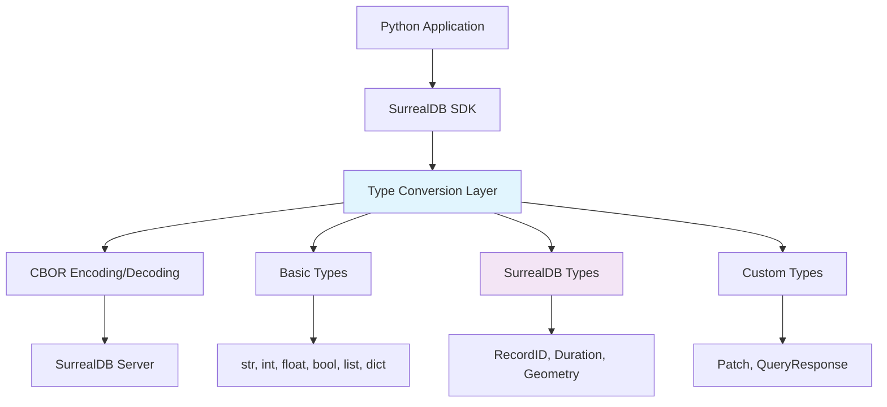

# Data Types Overview

SurrealDB provides rich data types that go beyond traditional SQL databases. The Python SDK includes native support for all SurrealDB data types, making it easy to work with complex data structures in your Python applications.

## Supported Data Types

### Basic Types

| Type | Python Equivalent | Description |
|------|------------------|-------------|
| **String** | `str` | Text data |
| **Number** | `int`, `float`, `Decimal` | Numeric values |
| **Boolean** | `bool` | True/false values |
| **None** | `None` | Null values |
| **Array** | `list` | Ordered collections |
| **Object** | `dict` | Key-value pairs |

### SurrealDB-Specific Types

| Type | SDK Class | Description |
|------|-----------|-------------|
| **Record ID** | [`RecordID`](./record-id.md) | Unique record identifiers |
| **Table** | [`Table`](./table.md) | Table references |
| **Duration** | [`Duration`](./duration.md) | Time intervals |
| **DateTime** | [`IsoDateTimeWrapper`](./datetime.md) | Date and time values |
| **Geometry** | [`Geometry`](./geometry.md) | Spatial data types |
| **Range** | [`Range`](./range.md) | Numeric and date ranges |
| **Future** | [`Future`](./future.md) | Deferred computations |

### Advanced Types

| Type | SDK Class | Description |
|------|-----------|-------------|
| **Patch** | [`Patch`](./patch.md) | JSON Patch operations |
| **QueryResponse** | [`QueryResponse`](./query-response.md) | Query result metadata |

## Type System Architecture



## Working with Data Types

### Automatic Type Conversion

The SDK automatically converts between Python types and SurrealDB types:

```python
from surrealdb import Surreal
from datetime import datetime, timedelta

with Surreal("ws://localhost:8000/rpc") as db:
    db.signin({"username": "root", "password": "root"})
    db.use("myapp", "production")
    
    # Python types are automatically converted
    user = db.create("user", {
        "name": "John Doe",           # str -> String
        "age": 30,                    # int -> Number
        "height": 5.9,                # float -> Number
        "active": True,               # bool -> Boolean
        "tags": ["python", "dev"],    # list -> Array
        "metadata": {"role": "admin"}, # dict -> Object
        "created_at": datetime.now(), # datetime -> DateTime
    })
    
    print(f"Created user: {user[0]['id']}")
```

### Explicit Type Usage

For more control, use SDK-specific types:

```python
from surrealdb import Surreal
from surrealdb.data import RecordID, Duration
from surrealdb.data.types import GeometryPoint

with Surreal("ws://localhost:8000/rpc") as db:
    db.signin({"username": "root", "password": "root"})
    db.use("myapp", "production")
    
    # Use specific SurrealDB types
    user = db.create("user", {
        "name": "Jane Doe",
        "location": GeometryPoint(longitude=-122.4194, latitude=37.7749),
        "session_duration": Duration.parse("2h30m"),
        "manager": RecordID("user", "john_doe")
    })
    
    print(f"Created user with specific types: {user[0]['id']}")
```

## Type Conversion Examples

### Basic Type Conversions

```python
from surrealdb import Surreal

with Surreal("ws://localhost:8000/rpc") as db:
    db.signin({"username": "root", "password": "root"})
    db.use("examples", "types")
    
    # Create record with various Python types
    record = db.create("example", {
        # Basic types
        "text": "Hello, World!",
        "integer": 42,
        "decimal": 3.14159,
        "boolean": True,
        "null_value": None,
        
        # Collections
        "array": [1, 2, 3, "four", True],
        "object": {
            "nested": "value",
            "number": 123,
            "array": ["a", "b", "c"]
        },
        
        # Complex nested structure
        "complex": {
            "users": [
                {"name": "Alice", "age": 30},
                {"name": "Bob", "age": 25}
            ],
            "settings": {
                "theme": "dark",
                "notifications": True,
                "limits": [10, 50, 100]
            }
        }
    })
    
    print(f"Created record with mixed types: {record[0]['id']}")
```

### SurrealDB Type Conversions

```python
from surrealdb import Surreal
from surrealdb.data import RecordID
from surrealdb.data.types import Duration, GeometryPoint
from datetime import datetime

with Surreal("ws://localhost:8000/rpc") as db:
    db.signin({"username": "root", "password": "root"})
    db.use("examples", "types")
    
    # Create record with SurrealDB-specific types
    record = db.create("location", {
        "name": "San Francisco Office",
        
        # Record ID reference
        "manager": RecordID("employee", "john_doe"),
        
        # Geometry point
        "coordinates": GeometryPoint(
            longitude=-122.4194,
            latitude=37.7749
        ),
        
        # Duration
        "business_hours": Duration.parse("8h"),
        "lunch_break": Duration.parse("1h30m"),
        
        # DateTime (automatically converted)
        "established": datetime(2020, 1, 15),
        
        # Array of Record IDs
        "employees": [
            RecordID("employee", "alice"),
            RecordID("employee", "bob"),
            RecordID("employee", "charlie")
        ]
    })
    
    print(f"Created location with SurrealDB types: {record[0]['id']}")
```

## Type Validation and Errors

### Handling Type Errors

```python
from surrealdb import Surreal
from surrealdb.data import RecordID
from surrealdb.errors import SurrealDBMethodError

with Surreal("ws://localhost:8000/rpc") as db:
    db.signin({"username": "root", "password": "root"})
    db.use("examples", "validation")
    
    try:
        # Valid RecordID
        valid_record = RecordID("user", "john_doe")
        user = db.create("profile", {
            "user_id": valid_record,
            "name": "John Doe"
        })
        print(f"Created profile: {user[0]['id']}")
        
    except ValueError as e:
        print(f"Type validation error: {e}")
    except SurrealDBMethodError as e:
        print(f"Database error: {e}")
```

### Type Checking

```python
from surrealdb.data import RecordID
from surrealdb.data.types import GeometryPoint, Duration

def validate_user_data(data):
    """Validate user data types before database operations"""
    
    errors = []
    
    # Check required string fields
    if not isinstance(data.get("name"), str):
        errors.append("Name must be a string")
    
    # Check optional RecordID field
    if "manager" in data and not isinstance(data["manager"], RecordID):
        errors.append("Manager must be a RecordID")
    
    # Check optional geometry field
    if "location" in data and not isinstance(data["location"], GeometryPoint):
        errors.append("Location must be a GeometryPoint")
    
    # Check optional duration field
    if "session_timeout" in data and not isinstance(data["session_timeout"], Duration):
        errors.append("Session timeout must be a Duration")
    
    return errors

# Usage
user_data = {
    "name": "John Doe",
    "manager": RecordID("user", "jane_doe"),
    "location": GeometryPoint(-122.4194, 37.7749),
    "session_timeout": Duration.parse("30m")
}

validation_errors = validate_user_data(user_data)
if validation_errors:
    print(f"Validation errors: {validation_errors}")
else:
    print("User data is valid")
```

## Working with Query Results

### Type Preservation in Results

```python
from surrealdb import Surreal
from surrealdb.data import RecordID
from surrealdb.data.types import GeometryPoint, Duration

with Surreal("ws://localhost:8000/rpc") as db:
    db.signin({"username": "root", "password": "root"})
    db.use("examples", "results")
    
    # Create record with mixed types
    created = db.create("location", {
        "name": "Office",
        "coordinates": GeometryPoint(-122.4194, 37.7749),
        "manager": RecordID("user", "john"),
        "hours": Duration.parse("8h")
    })
    
    # Retrieve and examine types
    locations = db.select("location")
    
    for location in locations:
        print(f"Location ID: {location['id']} (type: {type(location['id'])})")
        print(f"Name: {location['name']} (type: {type(location['name'])})")
        print(f"Coordinates: {location['coordinates']} (type: {type(location['coordinates'])})")
        print(f"Manager: {location['manager']} (type: {type(location['manager'])})")
        print(f"Hours: {location['hours']} (type: {type(location['hours'])})")
```

### Type Conversion in Queries

```python
from surrealdb import Surreal
from surrealdb.data import RecordID

with Surreal("ws://localhost:8000/rpc") as db:
    db.signin({"username": "root", "password": "root"})
    db.use("examples", "queries")
    
    # Query with type-specific operations
    result = db.query("""
        SELECT 
            id,
            name,
            coordinates.longitude as lng,
            coordinates.latitude as lat,
            hours.seconds as hours_in_seconds,
            manager.id as manager_id
        FROM location
        WHERE coordinates.longitude < -120
    """)
    
    for record in result:
        print(f"Location: {record['name']}")
        print(f"  Longitude: {record['lng']}")
        print(f"  Latitude: {record['lat']}")
        print(f"  Hours (seconds): {record['hours_in_seconds']}")
        print(f"  Manager ID: {record['manager_id']}")
```

## Custom Type Serialization

### Creating Custom Types

```python
from dataclasses import dataclass
from typing import Dict, Any
from surrealdb.data.types import Duration

@dataclass
class WorkSchedule:
    """Custom type for work schedules"""
    
    start_time: str
    end_time: str
    break_duration: Duration
    days: list[str]
    
    def to_dict(self) -> Dict[str, Any]:
        """Convert to dictionary for SurrealDB storage"""
        return {
            "start_time": self.start_time,
            "end_time": self.end_time,
            "break_duration": self.break_duration,
            "days": self.days,
            "type": "work_schedule"
        }
    
    @classmethod
    def from_dict(cls, data: Dict[str, Any]) -> "WorkSchedule":
        """Create from dictionary retrieved from SurrealDB"""
        return cls(
            start_time=data["start_time"],
            end_time=data["end_time"],
            break_duration=data["break_duration"],
            days=data["days"]
        )

# Usage
from surrealdb import Surreal

with Surreal("ws://localhost:8000/rpc") as db:
    db.signin({"username": "root", "password": "root"})
    db.use("examples", "custom")
    
    # Create custom type instance
    schedule = WorkSchedule(
        start_time="09:00",
        end_time="17:00",
        break_duration=Duration.parse("1h"),
        days=["monday", "tuesday", "wednesday", "thursday", "friday"]
    )
    
    # Store in database
    employee = db.create("employee", {
        "name": "John Doe",
        "schedule": schedule.to_dict()
    })
    
    # Retrieve and reconstruct
    employees = db.select("employee")
    for emp in employees:
        if "schedule" in emp and emp["schedule"].get("type") == "work_schedule":
            reconstructed_schedule = WorkSchedule.from_dict(emp["schedule"])
            print(f"Employee {emp['name']} works {reconstructed_schedule.start_time}-{reconstructed_schedule.end_time}")
```

## Performance Considerations

### Efficient Type Usage

```python
from surrealdb import Surreal
from surrealdb.data import RecordID

with Surreal("ws://localhost:8000/rpc") as db:
    db.signin({"username": "root", "password": "root"})
    db.use("performance", "types")
    
    # ✅ Efficient: Use batch operations with consistent types
    users_data = [
        {
            "name": f"User {i}",
            "age": 20 + i,
            "active": True,
            "manager": RecordID("user", "admin") if i % 5 == 0 else None
        }
        for i in range(100)
    ]
    
    # Single batch insert is more efficient than individual creates
    users = db.insert("user", users_data)
    print(f"Created {len(users)} users efficiently")
    
    # ✅ Efficient: Use specific queries for type operations
    active_users = db.query("""
        SELECT id, name, age 
        FROM user 
        WHERE active = true 
        ORDER BY age
    """)
    
    print(f"Found {len(active_users)} active users")
```

### Memory-Efficient Type Handling

```python
from surrealdb import Surreal

def process_large_dataset():
    """Process large datasets efficiently with proper type handling"""
    
    with Surreal("ws://localhost:8000/rpc") as db:
        db.signin({"username": "root", "password": "root"})
        db.use("performance", "large")
        
        # Process in batches to avoid memory issues
        batch_size = 1000
        offset = 0
        
        while True:
            # Fetch batch with specific fields only
            batch = db.query(f"""
                SELECT id, name, created_at 
                FROM large_table 
                ORDER BY id 
                LIMIT {batch_size} 
                START {offset}
            """)
            
            if not batch:
                break
            
            # Process batch
            for record in batch:
                # Work with specific types
                record_id = record["id"]  # RecordID
                name = record["name"]     # str
                created = record["created_at"]  # datetime
                
                # Your processing logic here
                pass
            
            offset += batch_size
            print(f"Processed batch starting at {offset}")

process_large_dataset()
```

## Type Compatibility Matrix

### Python to SurrealDB

| Python Type | SurrealDB Type | Notes |
|-------------|----------------|-------|
| `str` | String | Direct mapping |
| `int` | Number | Direct mapping |
| `float` | Number | Direct mapping |
| `bool` | Boolean | Direct mapping |
| `None` | None | Direct mapping |
| `list` | Array | Recursive conversion |
| `dict` | Object | Recursive conversion |
| `datetime` | DateTime | Automatic conversion |
| `timedelta` | Duration | Use `Duration.parse()` |
| `Decimal` | Number | Precision preserved |

### SurrealDB to Python

| SurrealDB Type | Python Type | SDK Class |
|----------------|-------------|-----------|
| String | `str` | - |
| Number | `int`/`float` | - |
| Boolean | `bool` | - |
| None | `None` | - |
| Array | `list` | - |
| Object | `dict` | - |
| Record | `dict` | `RecordID` for IDs |
| Duration | `dict` | `Duration` |
| DateTime | `str` | `IsoDateTimeWrapper` |
| Geometry | `dict` | `GeometryPoint`, etc. |

## Best Practices

### ✅ Do

- Use appropriate SDK types for SurrealDB-specific data
- Validate types before database operations
- Use batch operations for consistent type handling
- Leverage automatic type conversion for basic types
- Handle type errors gracefully

### ❌ Don't

- Mix incompatible types in collections
- Ignore type validation errors
- Use raw dictionaries for complex SurrealDB types
- Forget to handle None values
- Assume all numeric types are the same

## Next Steps

Explore specific data types in detail:

1. **[Record ID](./record-id.md)** - Unique identifiers
2. **[Geometry Types](./geometry.md)** - Spatial data
3. **[Duration](./duration.md)** - Time intervals
4. **[DateTime](./datetime.md)** - Date and time handling
5. **[Table](./table.md)** - Table references
6. **[Patch](./patch.md)** - JSON Patch operations

---

**Need help with types?** Join our [Discord community](https://surrealdb.com/discord) for type-specific questions and support.