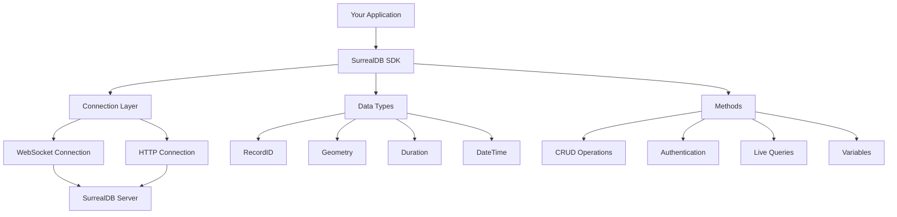

# Getting Started

Welcome to the official SurrealDB Python SDK documentation! This guide will help you get up and running with SurrealDB in your Python applications.

## What is SurrealDB?

SurrealDB is a scalable, distributed, collaborative, document-graph database for the realtime web. It combines the flexibility of JSON documents with the power of graph relationships and the simplicity of SQL queries.

## What is the Python SDK?

The SurrealDB Python SDK provides a comprehensive interface for interacting with SurrealDB from Python applications. It supports both synchronous and asynchronous operations, multiple connection types (WebSocket and HTTP), and all SurrealDB features including:

- **CRUD Operations**: Create, read, update, and delete records
- **Live Queries**: Real-time data synchronization
- **Authentication**: Secure access control
- **Advanced Data Types**: Geometry, duration, record IDs, and more
- **Transactions**: ACID-compliant operations

## Key Features

### 🚀 **Multiple Connection Types**
- WebSocket connections for real-time features
- HTTP connections for simple request-response patterns
- Both synchronous and asynchronous support

### 🔐 **Authentication & Security**
- JWT token authentication
- Namespace and database scoping
- Secure credential management

### 📊 **Rich Data Types**
- Native support for SurrealDB data types
- Geometry types for spatial data
- Duration and datetime handling
- Custom record ID management

### ⚡ **Real-time Features**
- Live queries for real-time updates
- Event-driven data synchronization
- Efficient change notifications

## Architecture Overview

The SDK is built around several core components:

## Connection Types

### Synchronous vs Asynchronous

The SDK provides both synchronous and asynchronous interfaces:

- **Synchronous (`Surreal`)**: Traditional blocking operations, easier to use for simple scripts
- **Asynchronous (`AsyncSurreal`)**: Non-blocking operations, better for web applications and concurrent workloads

### Transport Protocols

- **WebSocket (`ws://` or `wss://`)**: Full-duplex communication, supports live queries
- **HTTP (`http://` or `https://`)**: Request-response pattern, simpler but no live queries

## Next Steps

Ready to start using SurrealDB with Python? Here's what to do next:

1. **[Install the SDK](./installation.md)** - Get the library installed in your environment
2. **[Quick Start Guide](./quick-start.md)** - Build your first SurrealDB application
3. **[Connection Types](./connections/overview.md)** - Learn about different connection options
4. **[Core Methods](./methods/overview.md)** - Explore the available operations

## Need Help?

- 📖 **Documentation**: You're reading it! Explore the sidebar for detailed guides
- 💬 **Discord**: Join our [community Discord](https://surrealdb.com/discord)
- 🐛 **Issues**: Report bugs on [GitHub](https://github.com/surrealdb/surrealdb.py/issues)
- 📧 **Support**: Contact us at [support@surrealdb.com](mailto:support@surrealdb.com)

Let's build something amazing with SurrealDB! 🚀