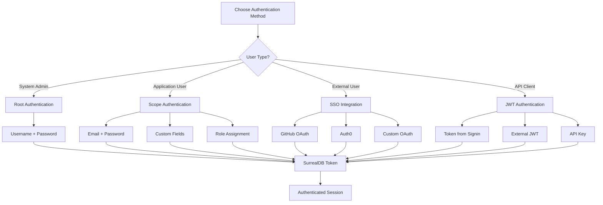

# Authentication Methods

This guide provides comprehensive examples of all authentication methods available in the SurrealDB Python SDK. The authentication documentation has been split into focused modules for easier understanding.

## Quick Navigation

Choose your authentication method:

### 🔰 [Start Here: Authentication Overview](../authentication/overview.md)
Get an overview of all authentication concepts and choose the right method for your needs.

### 🔑 [Basic Authentication](../authentication/basic-auth.md)
Learn email/password authentication for all user levels:
- Root user authentication
- Namespace and database users
- Scope user authentication
- Multi-role systems

### 🎫 [JWT Authentication](../authentication/jwt-auth.md)
Implement token-based authentication:
- Using tokens from signin
- External JWT integration
- Token management and validation
- API authentication patterns

### 🐙 [GitHub SSO](../authentication/github-sso.md)
Integrate GitHub OAuth authentication:
- OAuth flow implementation
- Organization-based access control
- Team membership validation
- Security best practices

### 🔐 [Auth0 Integration](../authentication/auth0.md)
Enterprise authentication with Auth0:
- Universal Login integration
- Role-based access control
- Multi-factor authentication
- Management API integration

### ⚙️ [Custom Scopes](../authentication/custom-scopes.md)
Advanced user management with custom scopes:
- Multi-role scope systems
- Permission-based access control
- Multi-tenant authentication
- Scope management utilities

## Quick Examples

### Basic Root Authentication

```python
from surrealdb import Surreal

# Synchronous
with Surreal("ws://localhost:8000/rpc") as db:
    db.signin({"username": "root", "password": "root"})
    db.use("myapp", "production")
    users = db.select("user")

# Asynchronous
import asyncio
from surrealdb import AsyncSurreal

async def main():
    async with AsyncSurreal("ws://localhost:8000/rpc") as db:
        await db.signin({"username": "root", "password": "root"})
        await db.use("myapp", "production")
        users = await db.select("user")

asyncio.run(main())
```

### Scope User Authentication

```python
from surrealdb import Surreal

# Sign up new user
with Surreal("ws://localhost:8000/rpc") as db:
    db.use("myapp", "production")
    
    token = db.signup({
        "namespace": "myapp",
        "database": "production",
        "scope": "user",
        "email": "user@example.com",
        "password": "SecurePass123!",
        "name": "John Doe"
    })

# Sign in existing user
with Surreal("ws://localhost:8000/rpc") as db:
    db.use("myapp", "production")
    
    token = db.signin({
        "namespace": "myapp",
        "database": "production",
        "scope": "user",
        "email": "user@example.com",
        "password": "SecurePass123!"
    })
```

### JWT Token Authentication

```python
from surrealdb import Surreal

# Use existing JWT token
with Surreal("ws://localhost:8000/rpc") as db:
    db.authenticate("your_jwt_token_here")
    db.use("myapp", "production")
    
    user_info = db.info()
    print(f"Authenticated as: {user_info}")
```

## Authentication Flow Diagram



## Security Best Practices

### ✅ Essential Security Measures

1. **Use Environment Variables**
   ```python
   import os
   
   credentials = {
       "username": os.getenv("SURREALDB_USER"),
       "password": os.getenv("SURREALDB_PASS")
   }
   ```

2. **Implement Proper Error Handling**
   ```python
   try:
       token = db.signin(credentials)
   except Exception as e:
       print(f"Authentication failed: {e}")
       # Handle authentication failure
   ```

3. **Use HTTPS/WSS in Production**
   ```python
   # Development
   db = Surreal("ws://localhost:8000/rpc")
   
   # Production
   db = Surreal("wss://your-domain.com/rpc")
   ```

4. **Validate Tokens Properly**
   ```python
   def validate_session(token):
       try:
           with Surreal("wss://your-domain.com/rpc") as db:
               db.authenticate(token)
               user_info = db.info()
               return user_info is not None
       except:
           return False
   ```

### ❌ Common Security Mistakes

- **Don't hardcode credentials** in source code
- **Don't use root credentials** in applications
- **Don't ignore authentication errors**
- **Don't skip token validation**
- **Don't use weak passwords**

## Getting Started

1. **New to SurrealDB Authentication?**
   Start with [Authentication Overview](../authentication/overview.md)

2. **Building a Simple App?**
   Use [Basic Authentication](../authentication/basic-auth.md)

3. **Need Token-Based Auth?**
   Implement [JWT Authentication](../authentication/jwt-auth.md)

4. **Want Social Login?**
   Try [GitHub SSO](../authentication/github-sso.md)

5. **Enterprise Requirements?**
   Use [Auth0 Integration](../authentication/auth0.md)

6. **Advanced Use Cases?**
   Create [Custom Scopes](../authentication/custom-scopes.md)

## Next Steps

Choose your authentication method and dive into the detailed guides:

- **[Authentication Overview](../authentication/overview.md)** - Understand the concepts
- **[Basic Authentication](../authentication/basic-auth.md)** - Start with email/password
- **[JWT Authentication](../authentication/jwt-auth.md)** - Implement token-based auth
- **[GitHub SSO](../authentication/github-sso.md)** - Add social login
- **[Auth0 Integration](../authentication/auth0.md)** - Enterprise authentication
- **[Custom Scopes](../authentication/custom-scopes.md)** - Advanced user management

Need help? Check the [troubleshooting guide](../troubleshooting.md) or join our community discussions.

#### Synchronous Example

```python
def root_authentication_sync():
    """Authenticate as root user (synchronous)"""
    from surrealdb import Surreal
    
    with Surreal("ws://localhost:8000/rpc") as db:
        try:
            # Authenticate as root user
            token = db.signin({
                "username": "root",
                "password": "root"
            })
            
            print("✅ Root authentication successful")
            print(f"Token: {token[:50]}..." if token else "No token returned")
            
            # Root users can access any namespace/database
            db.use("mycompany", "production")
            
            # Verify authentication by getting user info
            user_info = db.info()
            print(f"Authenticated as: {user_info}")
            
            # Perform admin operations
            version = db.version()
            print(f"SurrealDB version: {version}")
            
            return token
            
        except Exception as e:
            print(f"❌ Root authentication failed: {e}")
            raise

# Run example
root_token = root_authentication_sync()
```

#### Asynchronous Example

```python
import asyncio
from surrealdb import AsyncSurreal

async def root_authentication_async():
    """Authenticate as root user - asynchronous"""
    
    async with AsyncSurreal("ws://localhost:8000/rpc") as db:
        try:
            # Authenticate as root user
            token = await db.signin({
                "username": "root",
                "password": "root"
            })
            
            print("✅ Async root authentication successful")
            print(f"Token: {token[:50]}..." if token else "No token returned")
            
            # Select namespace and database
            await db.use("mycompany", "production")
            
            # Verify authentication
            user_info = await db.info()
            print(f"Authenticated as: {user_info}")
            
            # Perform operations
            users = await db.select("user")
            print(f"Found {len(users)} users")
            
            return token
            
        except Exception as e:
            print(f"❌ Async root authentication failed: {e}")
            raise

# Run async example
asyncio.run(root_authentication_async())
```

### Namespace User Authentication

Namespace users have access to all databases within a specific namespace.

```python
from surrealdb import Surreal

def namespace_authentication():
    """Authenticate as namespace user"""
    
    with Surreal("ws://localhost:8000/rpc") as db:
        try:
            # First, create namespace user (requires root access)
            db.signin({"username": "root", "password": "root"})
            
            # Create namespace user
            db.query("""
                DEFINE USER namespace_admin ON NAMESPACE mycompany PASSWORD 'admin123' ROLES OWNER;
            """)
            
            print("✅ Namespace user created")
            
            # Now authenticate as namespace user
            token = db.signin({
                "namespace": "mycompany",
                "username": "namespace_admin",
                "password": "admin123"
            })
            
            print("✅ Namespace authentication successful")
            print(f"Token: {token[:50]}..." if token else "No token returned")
            
            # Can access any database in this namespace
            db.use("mycompany", "production")
            
            # Verify access
            user_info = db.info()
            print(f"Namespace user info: {user_info}")
            
            return token
            
        except Exception as e:
            print(f"❌ Namespace authentication failed: {e}")
            raise

# Run example
namespace_token = namespace_authentication()
```

### Database User Authentication

Database users have access to a specific database within a namespace.

```python
from surrealdb import Surreal

def database_authentication():
    """Authenticate as database user"""
    
    with Surreal("ws://localhost:8000/rpc") as db:
        try:
            # Setup: Create database user (requires namespace or root access)
            db.signin({"username": "root", "password": "root"})
            db.use("mycompany", "production")
            
            # Create database user
            db.query("""
                DEFINE USER db_admin ON DATABASE PASSWORD 'dbpass123' ROLES OWNER;
            """)
            
            print("✅ Database user created")
            
            # Authenticate as database user
            token = db.signin({
                "namespace": "mycompany",
                "database": "production",
                "username": "db_admin",
                "password": "dbpass123"
            })
            
            print("✅ Database authentication successful")
            print(f"Token: {token[:50]}..." if token else "No token returned")
            
            # Already connected to the specific database
            # Verify access
            user_info = db.info()
            print(f"Database user info: {user_info}")
            
            # Can perform database operations
            tables = db.query("INFO FOR DB;")
            print(f"Database info: {tables}")
            
            return token
            
        except Exception as e:
            print(f"❌ Database authentication failed: {e}")
            raise

# Run example
db_token = database_authentication()
```

### Scope User Authentication

Scope users are application users with custom authentication logic.

```python
from surrealdb import Surreal

def setup_user_scope():
    """Setup user scope for application authentication"""
    
    with Surreal("ws://localhost:8000/rpc") as db:
        # Authenticate as root to setup scope
        db.signin({"username": "root", "password": "root"})
        db.use("mycompany", "production")
        
        # Define user scope with email/password authentication
        db.query("""
            DEFINE SCOPE user SESSION 24h
            SIGNUP ( CREATE user SET email = $email, pass = crypto::argon2::generate($pass), name = $name, created_at = time::now() )
            SIGNIN ( SELECT * FROM user WHERE email = $email AND crypto::argon2::compare(pass, $pass) );
        """)
        
        print("✅ User scope defined")

def scope_user_signup():
    """Sign up new user with scope authentication"""
    
    with Surreal("ws://localhost:8000/rpc") as db:
        try:
            # Select namespace and database
            db.use("mycompany", "production")
            
            # Sign up new user
            token = db.signup({
                "namespace": "mycompany",
                "database": "production",
                "scope": "user",
                "email": "john@example.com",
                "password": "securepass123",
                "name": "John Doe"
            })
            
            print("✅ User signup successful")
            print(f"User token: {token[:50]}..." if token else "No token returned")
            
            # Verify user creation
            user_info = db.info()
            print(f"New user info: {user_info}")
            
            return token
            
        except Exception as e:
            print(f"❌ User signup failed: {e}")
            raise

def scope_user_signin():
    """Sign in existing user with scope authentication"""
    
    with Surreal("ws://localhost:8000/rpc") as db:
        try:
            # Select namespace and database
            db.use("mycompany", "production")
            
            # Sign in existing user
            token = db.signin({
                "namespace": "mycompany",
                "database": "production",
                "scope": "user",
                "email": "john@example.com",
                "password": "securepass123"
            })
            
            print("✅ User signin successful")
            print(f"User token: {token[:50]}..." if token else "No token returned")
            
            # Verify authentication
            user_info = db.info()
            print(f"Signed in user: {user_info}")
            
            # User can only access their own data
            user_data = db.select("user")
            print(f"User can see {len(user_data)} user records")
            
            return token
            
        except Exception as e:
            print(f"❌ User signin failed: {e}")
            raise

# Run examples
setup_user_scope()
signup_token = scope_user_signup()
signin_token = scope_user_signin()
```

## JWT Token Authentication

### Direct JWT Authentication

Use JWT tokens obtained from external sources or previous authentication.

#### Synchronous JWT Authentication

```python
from surrealdb import Surreal
import jwt
import datetime

def jwt_authentication_sync():
    """Authenticate using JWT token - synchronous"""
    
    # First, get a JWT token (from previous signin or external source)
    with Surreal("ws://localhost:8000/rpc") as db:
        # Get token from signin
        token = db.signin({
            "namespace": "mycompany",
            "database": "production",
            "scope": "user",
            "email": "john@example.com",
            "password": "securepass123"
        })
        
        print(f"✅ Obtained JWT token: {token[:50]}...")
    
    # Now use the JWT token for authentication
    with Surreal("ws://localhost:8000/rpc") as db:
        try:
            # Authenticate using JWT token
            db.authenticate(token)
            
            print("✅ JWT authentication successful")
            
            # Select namespace and database
            db.use("mycompany", "production")
            
            # Verify authentication
            user_info = db.info()
            print(f"JWT authenticated user: {user_info}")
            
            # Perform operations
            user_data = db.select("user")
            print(f"Accessed {len(user_data)} user records")
            
            return token
            
        except Exception as e:
            print(f"❌ JWT authentication failed: {e}")
            raise

# Run example
jwt_token = jwt_authentication_sync()
```

#### Asynchronous JWT Authentication

```python
import asyncio
from surrealdb import AsyncSurreal

async def jwt_authentication_async():
    """Authenticate using JWT token - asynchronous"""
    
    # Get token from previous authentication
    async with AsyncSurreal("ws://localhost:8000/rpc") as db:
        token = await db.signin({
            "namespace": "mycompany",
            "database": "production",
            "scope": "user",
            "email": "john@example.com",
            "password": "securepass123"
        })
        
        print(f"✅ Obtained JWT token: {token[:50]}...")
    
    # Use JWT token for authentication
    async with AsyncSurreal("ws://localhost:8000/rpc") as db:
        try:
            # Authenticate using JWT token
            await db.authenticate(token)
            
            print("✅ Async JWT authentication successful")
            
            # Select namespace and database
            await db.use("mycompany", "production")
            
            # Verify authentication
            user_info = await db.info()
            print(f"JWT authenticated user: {user_info}")
            
            # Perform operations
            user_data = await db.select("user")
            print(f"Accessed {len(user_data)} user records")
            
            return token
            
        except Exception as e:
            print(f"❌ Async JWT authentication failed: {e}")
            raise

# Run async example
asyncio.run(jwt_authentication_async())
```

### External JWT Integration

Handle JWT tokens from external authentication providers.

```python
from surrealdb import Surreal
import jwt
import requests
from datetime import datetime, timedelta

class ExternalJWTHandler:
    """Handle JWT tokens from external providers"""
    
    def __init__(self, db_url, namespace, database):
        self.db_url = db_url
        self.namespace = namespace
        self.database = database
        self.current_token = None
        self.token_expiry = None
    
    def validate_external_jwt(self, external_token, secret_key):
        """Validate JWT token from external provider"""
        try:
            # Decode and validate external JWT
            payload = jwt.decode(external_token, secret_key, algorithms=['HS256'])
            
            print(f"✅ External JWT valid for user: {payload.get('email')}")
            return payload
            
        except jwt.ExpiredSignatureError:
            print("❌ External JWT token expired")
            raise
        except jwt.InvalidTokenError:
            print("❌ External JWT token invalid")
            raise
    
    def create_surrealdb_user(self, user_payload):
        """Create or update user in SurrealDB based on external JWT"""
        
        with Surreal(self.db_url) as db:
            # Authenticate as admin to manage users
            db.signin({"username": "root", "password": "root"})
            db.use(self.namespace, self.database)
            
            # Create or update user
            user_data = {
                "email": user_payload.get("email"),
                "name": user_payload.get("name"),
                "external_id": user_payload.get("sub"),
                "provider": user_payload.get("iss", "external"),
                "updated_at": datetime.now().isoformat()
            }
            
            # Upsert user based on email
            user = db.query(
                "SELECT * FROM user WHERE email = $email",
                {"email": user_data["email"]}
            )
            
            if user:
                # Update existing user
                updated_user = db.merge(user[0]["id"], user_data)
                print(f"✅ Updated existing user: {updated_user[0]['email']}")
                return updated_user[0]
            else:
                # Create new user
                new_user = db.create("user", user_data)
                print(f"✅ Created new user: {new_user[0]['email']}")
                return new_user[0]
    
    def authenticate_with_external_jwt(self, external_token, secret_key):
        """Complete authentication flow with external JWT"""
        
        # Validate external token
        payload = self.validate_external_jwt(external_token, secret_key)
        
        # Create/update user in SurrealDB
        user = self.create_surrealdb_user(payload)
        
        # Get SurrealDB token for the user
        with Surreal(self.db_url) as db:
            db.use(self.namespace, self.database)
            
            # Sign in as the user to get SurrealDB token
            token = db.signin({
                "namespace": self.namespace,
                "database": self.database,
                "scope": "user",
                "email": user["email"],
                "password": "external_auth"  # Special handling for external auth
            })
            
            self.current_token = token
            self.token_expiry = datetime.now() + timedelta(hours=24)
            
            print(f"✅ SurrealDB authentication successful")
            return token
    
    def get_authenticated_connection(self):
        """Get authenticated SurrealDB connection"""
        
        if not self.current_token or datetime.now() >= self.token_expiry:
            raise Exception("No valid token available. Please authenticate first.")
        
        db = Surreal(self.db_url)
        db.authenticate(self.current_token)
        db.use(self.namespace, self.database)
        
        return db

# Example usage
def external_jwt_example():
    """Example of external JWT authentication"""
    
    # Simulate external JWT token
    external_payload = {
        "sub": "external_user_123",
        "email": "external@example.com",
        "name": "External User",
        "iss": "external_provider",
        "exp": datetime.now() + timedelta(hours=1)
    }
    
    secret_key = "your_external_jwt_secret"
    external_token = jwt.encode(external_payload, secret_key, algorithm='HS256')
    
    # Setup JWT handler
    jwt_handler = ExternalJWTHandler(
        "ws://localhost:8000/rpc",
        "mycompany",
        "production"
    )
    
    try:
        # Authenticate with external JWT
        surrealdb_token = jwt_handler.authenticate_with_external_jwt(
            external_token, 
            secret_key
        )
        
        # Use authenticated connection
        with jwt_handler.get_authenticated_connection() as db:
            user_info = db.info()
            print(f"Authenticated external user: {user_info}")
            
            # Perform operations
            user_data = db.select("user")
            print(f"User can access {len(user_data)} records")
        
        return surrealdb_token
        
    except Exception as e:
        print(f"❌ External JWT authentication failed: {e}")
        raise

# Run example
external_token = external_jwt_example()
```

## SSO via GitHub

Implement GitHub OAuth authentication with SurrealDB.

```python
from surrealdb import Surreal
import requests
import secrets
import urllib.parse
from datetime import datetime

class GitHubSSOHandler:
    """Handle GitHub OAuth authentication"""
    
    def __init__(self, client_id, client_secret, redirect_uri, db_url, namespace, database):
        self.client_id = client_id
        self.client_secret = client_secret
        self.redirect_uri = redirect_uri
        self.db_url = db_url
        self.namespace = namespace
        self.database = database
        self.github_api_base = "https://api.github.com"
        self.github_oauth_base = "https://github.com/login/oauth"
    
    def generate_auth_url(self, scopes=None):
        """Generate GitHub OAuth authorization URL"""
        
        if scopes is None:
            scopes = ["user:email", "read:user"]
        
        state = secrets.token_urlsafe(32)
        
        params = {
            "client_id": self.client_id,
            "redirect_uri": self.redirect_uri,
            "scope": " ".join(scopes),
            "state": state,
            "response_type": "code"
        }
        
        auth_url = f"{self.github_oauth_base}/authorize?" + urllib.parse.urlencode(params)
        
        print(f"🔗 GitHub OAuth URL: {auth_url}")
        print(f"🔑 State token: {state}")
        
        return auth_url, state
    
    def exchange_code_for_token(self, code, state):
        """Exchange authorization code for access token"""
        
        token_data = {
            "client_id": self.client_id,
            "client_secret": self.client_secret,
            "code": code,
            "redirect_uri": self.redirect_uri,
            "state": state
        }
        
        headers = {"Accept": "application/json"}
        
        response = requests.post(
            f"{self.github_oauth_base}/access_token",
            data=token_data,
            headers=headers
        )
        
        if response.status_code == 200:
            token_info = response.json()
            access_token = token_info.get("access_token")
            
            if access_token:
                print("✅ GitHub access token obtained")
                return access_token
            else:
                raise Exception(f"No access token in response: {token_info}")
        else:
            raise Exception(f"Token exchange failed: {response.status_code} - {response.text}")
    
    def get_github_user_info(self, access_token):
        """Get user information from GitHub API"""
        
        headers = {
            "Authorization": f"token {access_token}",
            "Accept": "application/vnd.github.v3+json"
        }
        
        # Get user profile
        user_response = requests.get(f"{self.github_api_base}/user", headers=headers)
        
        if user_response.status_code != 200:
            raise Exception(f"Failed to get user info: {user_response.status_code}")
        
        user_data = user_response.json()
        
        # Get user emails
        emails_response = requests.get(f"{self.github_api_base}/user/emails", headers=headers)
        
        if emails_response.status_code == 200:
            emails = emails_response.json()
            primary_email = next((email["email"] for email in emails if email["primary"]), None)
            user_data["primary_email"] = primary_email
        
        print(f"✅ GitHub user info retrieved: {user_data.get('login')}")
        return user_data
    
    def create_or_update_user(self, github_user):
        """Create or update user in SurrealDB"""
        
        with Surreal(self.db_url) as db:
            # Authenticate as admin
            db.signin({"username": "root", "password": "root"})
            db.use(self.namespace, self.database)
            
            # Prepare user data
            user_data = {
                "email": github_user.get("primary_email") or github_user.get("email"),
                "name": github_user.get("name") or github_user.get("login"),
                "username": github_user.get("login"),
                "github_id": github_user.get("id"),
                "avatar_url": github_user.get("avatar_url"),
                "github_profile": github_user.get("html_url"),
                "provider": "github",
                "updated_at": datetime.now().isoformat()
            }
            
            # Check if user exists
            existing_user = db.query(
                "SELECT * FROM user WHERE github_id = $github_id OR email = $email",
                {
                    "github_id": user_data["github_id"],
                    "email": user_data["email"]
                }
            )
            
            if existing_user:
                # Update existing user
                user_id = existing_user[0]["id"]
                updated_user = db.merge(user_id, user_data)
                print(f"✅ Updated existing user: {updated_user[0]['email']}")
                return updated_user[0]
            else:
                # Create new user
                new_user = db.create("user", user_data)
                print(f"✅ Created new user: {new_user[0]['email']}")
                return new_user[0]
    
    def authenticate_user(self, user):
        """Authenticate user and return SurrealDB token"""
        
        with Surreal(self.db_url) as db:
            db.use(self.namespace, self.database)
            
            # For GitHub SSO, we'll create a special signin method
            # In a real implementation, you'd have a scope that handles GitHub auth
            
            # For this example, we'll use a simplified approach
            # In production, set up proper scope authentication
            
            try:
                # Try to sign in with email (requires proper scope setup)
                token = db.signin({
                    "namespace": self.namespace,
                    "database": self.database,
                    "scope": "user",
                    "email": user["email"],
                    "provider": "github"
                })
                
                print("✅ SurrealDB authentication successful")
                return token
                
            except Exception as e:
                print(f"⚠️ Scope signin failed, using admin token: {e}")
                
                # Fallback: create a custom token (for demo purposes)
                # In production, implement proper scope-based authentication
                admin_token = db.signin({"username": "root", "password": "root"})
                return admin_token
    
    def complete_oauth_flow(self, code, state):
        """Complete the OAuth flow"""
        
        try:
            # Exchange code for access token
            access_token = self.exchange_code_for_token(code, state)
            
            # Get user info from GitHub
            github_user = self.get_github_user_info(access_token)
            
            # Create/update user in SurrealDB
            user = self.create_or_update_user(github_user)
            
            # Authenticate user
            surrealdb_token = self.authenticate_user(user)
            
            return {
                "user": user,
                "github_token": access_token,
                "surrealdb_token": surrealdb_token
            }
            
        except Exception as e:
            print(f"❌ OAuth flow failed: {e}")
            raise

def github_sso_example():
    """Example of GitHub SSO authentication"""
    
    # GitHub OAuth app credentials (register at https://github.com/settings/applications/new)
    github_config = {
        "client_id": "your_github_client_id",
        "client_secret": "your_github_client_secret",
        "redirect_uri": "http://localhost:8080/auth/github/callback"
    }
    
    # Initialize GitHub SSO handler
    github_sso = GitHubSSOHandler(
        client_id=github_config["client_id"],
        client_secret=github_config["client_secret"],
        redirect_uri=github_config["redirect_uri"],
        db_url="ws://localhost:8000/rpc",
        namespace="mycompany",
        database="production"
    )
    
    # Step 1: Generate authorization URL
    auth_url, state = github_sso.generate_auth_url()
    
    print("\n📋 GitHub SSO Flow:")
    print("1. Visit the authorization URL")
    print("2. Authorize the application")
    print("3. Copy the 'code' parameter from the callback URL")
    print("4. Use the code to complete authentication")
    
    # In a real application, you'd redirect the user to auth_url
    # and handle the callback to get the code
    
    # For demo purposes, simulate the callback
    # In practice, you'd get these from the callback URL
    demo_code = "demo_authorization_code"
    demo_state = state
    
    try:
        # Step 2: Complete OAuth flow (in real app, this happens in callback handler)
        # auth_result = github_sso.complete_oauth_flow(demo_code, demo_state)
        
        print("\n✅ GitHub SSO setup complete")
        print("To test:")
        print(f"1. Visit: {auth_url}")
        print("2. Complete authorization")
        print("3. Extract code from callback URL")
        print("4. Call complete_oauth_flow(code, state)")
        
        return github_sso
        
    except Exception as e:
        print(f"❌ GitHub SSO example failed: {e}")
        return None

# Run example
github_handler = github_sso_example()
```

## Auth0 Integration

Implement Auth0 authentication with SurrealDB.

```python
from surrealdb import Surreal
import requests
import jwt
import json
from datetime import datetime
from urllib.parse import urlencode, quote_plus

class Auth0Handler:
    """Handle Auth0 authentication integration"""
    
    def __init__(self, domain, client_id, client_secret, audience, db_url, namespace, database):
        self.domain = domain
        self.client_id = client_id
        self.client_secret = client_secret
        self.audience = audience
        self.db_url = db_url
        self.namespace = namespace
        self.database = database
        self.auth0_base = f"https://{domain}"
    
    def get_auth0_public_key(self):
        """Get Auth0 public key for JWT verification"""
        
        jwks_url = f"{self.auth0_base}/.well-known/jwks.json"
        response = requests.get(jwks_url)
        
        if response.status_code == 200:
            jwks = response.json()
            return jwks
        else:
            raise Exception(f"Failed to get JWKS: {response.status_code}")
    
    def verify_auth0_token(self, token):
        """Verify Auth0 JWT token"""
        
        try:
            # Get the public key
            jwks = self.get_auth0_public_key()
            
            # Decode token header to get key ID
            unverified_header = jwt.get_unverified_header(token)
            key_id = unverified_header.get("kid")
            
            # Find the correct key
            key = None
            for jwk in jwks["keys"]:
                if jwk["kid"] == key_id:
                    key = jwt.algorithms.RSAAlgorithm.from_jwk(json.dumps(jwk))
                    break
            
            if not key:
                raise Exception("Unable to find appropriate key")
            
            # Verify and decode token
            payload = jwt.decode(
                token,
                key,
                algorithms=["RS256"],
                audience=self.audience,
                issuer=f"{self.auth0_base}/"
            )
            
            print(f"✅ Auth0 token verified for user: {payload.get('email')}")
            return payload
            
        except jwt.ExpiredSignatureError:
            print("❌ Auth0 token expired")
            raise
        except jwt.InvalidTokenError as e:
            print(f"❌ Auth0 token invalid: {e}")
            raise
    
    def get_auth0_user_info(self, access_token):
        """Get user information from Auth0"""
        
        headers = {"Authorization": f"Bearer {access_token}"}
        
        response = requests.get(f"{self.auth0_base}/userinfo", headers=headers)
        
        if response.status_code == 200:
            user_info = response.json()
            print(f"✅ Auth0 user info retrieved: {user_info.get('email')}")
            return user_info
        else:
            raise Exception(f"Failed to get user info: {response.status_code} - {response.text}")
    
    def create_or_update_user(self, auth0_user):
        """Create or update user in SurrealDB"""
        
        with Surreal(self.db_url) as db:
            # Authenticate as admin
            db.signin({"username": "root", "password": "root"})
            db.use(self.namespace, self.database)
            
            # Prepare user data
            user_data = {
                "email": auth0_user.get("email"),
                "name": auth0_user.get("name"),
                "nickname": auth0_user.get("nickname"),
                "auth0_id": auth0_user.get("sub"),
                "picture": auth0_user.get("picture"),
                "email_verified": auth0