# Core Methods Overview

The SurrealDB Python SDK provides a comprehensive set of methods for interacting with your database. This guide introduces all available methods and helps you understand when to use each one.

## Method Categories

The SDK methods are organized into several categories:

```mermaid
graph TB
    A[SurrealDB Methods] --> B[Connection Management]
    A --> C[Authentication]
    A --> D[Database Operations]
    A --> E[CRUD Operations]
    A --> F[Live Queries]
    A --> G[Variables]
    A --> H[Utilities]
    
    B --> B1[connect]
    B --> B2[close]
    B --> B3[use]
    
    C --> C1[signin]
    C --> C2[signup]
    C --> C3[authenticate]
    C --> C4[invalidate]
    C --> C5[info]
    
    D --> D1[query]
    D --> D2[version]
    
    E --> E1[select]
    E --> E2[create]
    E --> E3[insert]
    E --> E4[update]
    E --> E5[upsert]
    E --> E6[merge]
    E --> E7[patch]
    E --> E8[delete]
    E --> E9[insert_relation]
    
    F --> F1[live]
    F --> F2[subscribe_live]
    F --> F3[kill]
    
    G --> G1[let]
    G --> G2[unset]
```



## Quick Reference

### Connection Management

| Method | Purpose | Example |
|--------|---------|---------|
| [`connect()`](#connect) | Connect to database | `db.connect("ws://localhost:8000/rpc")` |
| [`close()`](#close) | Close connection | `db.close()` |
| [`use()`](#use) | Select namespace/database | `db.use("myapp", "production")` |

### Authentication

| Method | Purpose | Example |
|--------|---------|---------|
| [`signin()`](#signin) | Sign in with credentials | `db.signin({"username": "root", "password": "root"})` |
| [`signup()`](#signup) | Sign up new user | `db.signup({"username": "user", "password": "pass"})` |
| [`authenticate()`](#authenticate) | Authenticate with token | `db.authenticate("jwt_token")` |
| [`invalidate()`](#invalidate) | Invalidate session | `db.invalidate()` |
| [`info()`](#info) | Get user info | `db.info()` |

### CRUD Operations

| Method | Purpose | Example |
|--------|---------|---------|
| [`select()`](#select) | Read records | `db.select("user")` |
| [`create()`](#create) | Create records | `db.create("user", {"name": "John"})` |
| [`insert()`](#insert) | Insert records | `db.insert("user", [{"name": "John"}])` |
| [`update()`](#update) | Update records | `db.update("user:123", {"name": "Jane"})` |
| [`upsert()`](#upsert) | Insert or update | `db.upsert("user:123", {"name": "Jane"})` |
| [`merge()`](#merge) | Merge data | `db.merge("user:123", {"active": True})` |
| [`patch()`](#patch) | Apply JSON patches | `db.patch("user:123", [{"op": "replace", "path": "/name", "value": "Jane"}])` |
| [`delete()`](#delete) | Delete records | `db.delete("user:123")` |

### Live Queries

| Method | Purpose | Example |
|--------|---------|---------|
| [`live()`](#live) | Start live query | `db.live("user")` |
| [`subscribe_live()`](#subscribe-live) | Subscribe to updates | `db.subscribe_live(live_id)` |
| [`kill()`](#kill) | Stop live query | `db.kill(live_id)` |

### Variables

| Method | Purpose | Example |
|--------|---------|---------|
| [`let()`](#let) | Set variable | `db.let("name", "John")` |
| [`unset()`](#unset) | Remove variable | `db.unset("name")` |

### Database Operations

| Method | Purpose | Example |
|--------|---------|---------|
| [`query()`](#query) | Execute SurrealQL | `db.query("SELECT * FROM user")` |
| [`version()`](#version) | Get server version | `db.version()` |

## Method Details

### Connection Management

#### `connect()`

Establishes a connection to the SurrealDB server.

```python
from surrealdb import Surreal

# Manual connection
db = Surreal("ws://localhost:8000/rpc")
db.connect()

# Context manager (recommended)
with Surreal("ws://localhost:8000/rpc") as db:
    # Connection automatically established
    pass
```

#### `close()`

Closes the connection to the SurrealDB server.

```python
from surrealdb import Surreal

db = Surreal("ws://localhost:8000/rpc")
try:
    # Your operations
    pass
finally:
    db.close()  # Always close connections
```

#### `use()`

Selects the namespace and database for subsequent operations.

```python
from surrealdb import Surreal

with Surreal("ws://localhost:8000/rpc") as db:
    db.signin({"username": "root", "password": "root"})
    
    # Select namespace and database
    db.use("mycompany", "production")
    
    # All subsequent operations use this namespace/database
    users = db.select("user")
```

### Authentication

#### `signin()`

Authenticates with the database using credentials.

```python
from surrealdb import Surreal

with Surreal("ws://localhost:8000/rpc") as db:
    # Root user authentication
    db.signin({
        "username": "root",
        "password": "root"
    })
    
    # Namespace user authentication
    db.signin({
        "namespace": "mycompany",
        "username": "admin",
        "password": "admin123"
    })
    
    # Database user authentication
    db.signin({
        "namespace": "mycompany",
        "database": "production",
        "username": "user",
        "password": "user123"
    })
    
    # Scope authentication
    db.signin({
        "namespace": "mycompany",
        "database": "production",
        "scope": "user",
        "email": "user@example.com",
        "password": "password123"
    })
```

#### `signup()`

Creates a new user account with the specified scope.

```python
from surrealdb import Surreal

with Surreal("ws://localhost:8000/rpc") as db:
    # Sign up new user
    token = db.signup({
        "namespace": "mycompany",
        "database": "production",
        "scope": "user",
        "email": "newuser@example.com",
        "password": "newpassword123",
        "name": "New User"
    })
    
    print(f"New user token: {token}")
```

#### `authenticate()`

Authenticates using a JWT token.

```python
from surrealdb import Surreal

with Surreal("ws://localhost:8000/rpc") as db:
    # Authenticate with JWT token
    db.authenticate("eyJ0eXAiOiJKV1QiLCJhbGciOiJIUzI1NiJ9...")
    
    # Now you can perform operations
    users = db.select("user")
```

#### `invalidate()`

Invalidates the current authentication session.

```python
from surrealdb import Surreal

with Surreal("ws://localhost:8000/rpc") as db:
    db.signin({"username": "root", "password": "root"})
    
    # Perform authenticated operations
    users = db.select("user")
    
    # Invalidate session
    db.invalidate()
    
    # Further operations will require re-authentication
```

#### `info()`

Returns information about the currently authenticated user.

```python
from surrealdb import Surreal

with Surreal("ws://localhost:8000/rpc") as db:
    db.signin({
        "namespace": "mycompany",
        "database": "production",
        "scope": "user",
        "email": "user@example.com",
        "password": "password123"
    })
    
    # Get user information
    user_info = db.info()
    print(f"Current user: {user_info}")
```

### CRUD Operations

#### `select()`

Retrieves records from the database.

```python
from surrealdb import Surreal
from surrealdb.data import RecordID

with Surreal("ws://localhost:8000/rpc") as db:
    db.signin({"username": "root", "password": "root"})
    db.use("myapp", "production")
    
    # Select all records from a table
    all_users = db.select("user")
    
    # Select specific record by ID
    user = db.select("user:123")
    
    # Select using RecordID object
    record_id = RecordID("user", "123")
    user = db.select(record_id)
    
    print(f"Found {len(all_users)} users")
```

#### `create()`

Creates new records in the database.

```python
from surrealdb import Surreal
from surrealdb.data import RecordID

with Surreal("ws://localhost:8000/rpc") as db:
    db.signin({"username": "root", "password": "root"})
    db.use("myapp", "production")
    
    # Create record with auto-generated ID
    user = db.create("user", {
        "name": "John Doe",
        "email": "john@example.com",
        "age": 30
    })
    
    # Create record with specific ID
    user = db.create("user:john", {
        "name": "John Doe",
        "email": "john@example.com",
        "age": 30
    })
    
    # Create using RecordID
    record_id = RecordID("user", "jane")
    user = db.create(record_id, {
        "name": "Jane Smith",
        "email": "jane@example.com",
        "age": 28
    })
    
    print(f"Created user: {user[0]['id']}")
```

#### `insert()`

Inserts one or more records into a table.

```python
from surrealdb import Surreal

with Surreal("ws://localhost:8000/rpc") as db:
    db.signin({"username": "root", "password": "root"})
    db.use("myapp", "production")
    
    # Insert single record
    user = db.insert("user", {
        "name": "John Doe",
        "email": "john@example.com"
    })
    
    # Insert multiple records
    users = db.insert("user", [
        {"name": "Alice", "email": "alice@example.com"},
        {"name": "Bob", "email": "bob@example.com"},
        {"name": "Charlie", "email": "charlie@example.com"}
    ])
    
    print(f"Inserted {len(users)} users")
```

#### `update()`

Updates records by replacing their content entirely.

```python
from surrealdb import Surreal

with Surreal("ws://localhost:8000/rpc") as db:
    db.signin({"username": "root", "password": "root"})
    db.use("myapp", "production")
    
    # Update specific record (replaces entire content)
    updated_user = db.update("user:john", {
        "name": "John Smith",
        "email": "john.smith@example.com",
        "age": 31,
        "active": True
    })
    
    # Update all records in table
    all_updated = db.update("user", {
        "updated_at": "2023-01-01T00:00:00Z"
    })
    
    print(f"Updated user: {updated_user[0]['name']}")
```

#### `upsert()`

Inserts a record if it doesn't exist, or updates it if it does.

```python
from surrealdb import Surreal

with Surreal("ws://localhost:8000/rpc") as db:
    db.signin({"username": "root", "password": "root"})
    db.use("myapp", "production")
    
    # Upsert record (insert or update)
    user = db.upsert("user:john", {
        "name": "John Doe",
        "email": "john@example.com",
        "age": 30,
        "active": True
    })
    
    print(f"Upserted user: {user[0]['id']}")
```

#### `merge()`

Merges data into existing records without replacing the entire content.

```python
from surrealdb import Surreal

with Surreal("ws://localhost:8000/rpc") as db:
    db.signin({"username": "root", "password": "root"})
    db.use("myapp", "production")
    
    # Merge data into specific record
    updated_user = db.merge("user:john", {
        "age": 31,
        "last_login": "2023-01-01T12:00:00Z"
    })
    
    # Merge data into all records in table
    all_updated = db.merge("user", {
        "updated_at": "2023-01-01T00:00:00Z"
    })
    
    print(f"Merged data for user: {updated_user[0]['name']}")
```

#### `patch()`

Applies JSON Patch operations to records.

```python
from surrealdb import Surreal

with Surreal("ws://localhost:8000/rpc") as db:
    db.signin({"username": "root", "password": "root"})
    db.use("myapp", "production")
    
    # Apply JSON Patch operations
    patched_user = db.patch("user:john", [
        {"op": "replace", "path": "/age", "value": 32},
        {"op": "add", "path": "/tags", "value": ["developer", "python"]},
        {"op": "remove", "path": "/temp_field"}
    ])
    
    print(f"Patched user: {patched_user[0]['name']}")
```

#### `delete()`

Deletes records from the database.

```python
from surrealdb import Surreal

with Surreal("ws://localhost:8000/rpc") as db:
    db.signin({"username": "root", "password": "root"})
    db.use("myapp", "production")
    
    # Delete specific record
    deleted_user = db.delete("user:john")
    
    # Delete all records in table
    all_deleted = db.delete("user")
    
    print(f"Deleted user: {deleted_user[0]['id'] if deleted_user else 'None'}")
```

#### `insert_relation()`

Inserts relation records between other records.

```python
from surrealdb import Surreal

with Surreal("ws://localhost:8000/rpc") as db:
    db.signin({"username": "root", "password": "root"})
    db.use("myapp", "production")
    
    # Create users first
    user1 = db.create("user", {"name": "Alice"})
    user2 = db.create("user", {"name": "Bob"})
    
    # Insert relation
    relation = db.insert_relation("follows", {
        "in": user1[0]["id"],
        "out": user2[0]["id"],
        "since": "2023-01-01T00:00:00Z"
    })
    
    print(f"Created relation: {relation[0]['id']}")
```

### Live Queries

#### `live()`

Starts a live query that monitors changes to a table.

```python
from surrealdb import Surreal

with Surreal("ws://localhost:8000/rpc") as db:
    db.signin({"username": "root", "password": "root"})
    db.use("myapp", "production")
    
    # Start live query
    live_id = db.live("user")
    print(f"Started live query: {live_id}")
    
    # Start live query with diff mode
    live_id_diff = db.live("user", diff=True)
    print(f"Started live query with diff: {live_id_diff}")
```

#### `subscribe_live()`

Subscribes to updates from a live query.

```python
from surrealdb import Surreal
import threading

with Surreal("ws://localhost:8000/rpc") as db:
    db.signin({"username": "root", "password": "root"})
    db.use("myapp", "production")
    
    live_id = db.live("user")
    
    def listen_for_updates():
        for update in db.subscribe_live(live_id):
            print(f"Live update: {update}")
    
    # Start listening in background thread
    listener = threading.Thread(target=listen_for_updates, daemon=True)
    listener.start()
    
    # Make changes to trigger updates
    db.create("user", {"name": "Test User"})
```

#### `kill()`

Stops a live query.

```python
from surrealdb import Surreal

with Surreal("ws://localhost:8000/rpc") as db:
    db.signin({"username": "root", "password": "root"})
    db.use("myapp", "production")
    
    live_id = db.live("user")
    
    # ... do some work with live query ...
    
    # Stop the live query
    db.kill(live_id)
    print("Live query stopped")
```

### Variables

#### `let()`

Sets a variable that can be used in subsequent queries.

```python
from surrealdb import Surreal

with Surreal("ws://localhost:8000/rpc") as db:
    db.signin({"username": "root", "password": "root"})
    db.use("myapp", "production")
    
    # Set simple variable
    db.let("name", "John Doe")
    
    # Set complex variable
    db.let("user_data", {
        "name": "John Doe",
        "email": "john@example.com",
        "age": 30
    })
    
    # Use variables in queries
    result = db.query("CREATE user SET name = $name, email = $user_data.email")
    print(f"Created user with variable: {result}")
```

#### `unset()`

Removes a previously set variable.

```python
from surrealdb import Surreal

with Surreal("ws://localhost:8000/rpc") as db:
    db.signin({"username": "root", "password": "root"})
    db.use("myapp", "production")
    
    # Set variable
    db.let("temp_var", "temporary value")
    
    # Use variable
    result = db.query("SELECT $temp_var as value")
    
    # Remove variable
    db.unset("temp_var")
    
    # Variable is no longer available
    print("Variable removed")
```

### Database Operations

#### `query()`

Executes raw SurrealQL queries.

```python
from surrealdb import Surreal

with Surreal("ws://localhost:8000/rpc") as db:
    db.signin({"username": "root", "password": "root"})
    db.use("myapp", "production")
    
    # Simple query
    users = db.query("SELECT * FROM user")
    
    # Query with variables
    result = db.query(
        "SELECT * FROM user WHERE age > $min_age",
        {"min_age": 18}
    )
    
    # Complex query
    complex_result = db.query("""
        BEGIN TRANSACTION;
        
        CREATE user:john SET name = "John", age = 30;
        CREATE user:jane SET name = "Jane", age = 28;
        
        RELATE user:john->follows->user:jane;
        
        COMMIT TRANSACTION;
    """)
    
    print(f"Query results: {len(result)} records")
```

#### `version()`

Returns the version of the SurrealDB server.

```python
from surrealdb import Surreal

with Surreal("ws://localhost:8000/rpc") as db:
    db.signin({"username": "root", "password": "root"})
    
    version = db.version()
    print(f"SurrealDB version: {version}")
```

## Method Patterns

### Synchronous vs Asynchronous

All methods are available in both synchronous and asynchronous versions:

```python
# Synchronous
from surrealdb import Surreal

with Surreal("ws://localhost:8000/rpc") as db:
    db.signin({"username": "root", "password": "root"})
    users = db.select("user")

# Asynchronous
import asyncio
from surrealdb import AsyncSurreal

async def async_example():
    async with AsyncSurreal("ws://localhost:8000/rpc") as db:
        await db.signin({"username": "root", "password": "root"})
        users = await db.select("user")

asyncio.run(async_example())
```

### Error Handling

```python
from surrealdb import Surreal
from surrealdb.errors import SurrealDBMethodError

with Surreal("ws://localhost:8000/rpc") as db:
    try:
        db.signin({"username": "root", "password": "root"})
        db.use("myapp", "production")
        
        result = db.create("user", {"name": "John"})
        
    except SurrealDBMethodError as e:
        print(f"SurrealDB error: {e}")
    except Exception as e:
        print(f"Unexpected error: {e}")
```

### Method Chaining

Some operations can be chained for convenience:

```python
from surrealdb import Surreal

with Surreal("ws://localhost:8000/rpc") as db:
    # Authentication and setup
    db.signin({"username": "root", "password": "root"})
    db.use("myapp", "production")
    
    # Set variables for reuse
    db.let("default_role", "user")
    db.let("created_at", "2023-01-01T00:00:00Z")
    
    # Perform operations
    user = db.create("user", {
        "name": "John Doe",
        "role": "$default_role",
        "created_at": "$created_at"
    })
```

## Next Steps

Now that you understand the available methods:

1. **[Authentication Methods](./authentication.md)** - Deep dive into authentication
2. **[CRUD Operations](./crud-operations.md)** - Master data manipulation
3. **[Live Queries](./live-queries.md)** - Learn real-time features
4. **[Variables](./variables.md)** - Use variables effectively
5. **[Database Operations](./database-operations.md)** - Advanced query techniques

## Best Practices

### ✅ Do

- Use context managers for automatic connection cleanup
- Handle errors appropriately for each method
- Use variables for reusable values
- Choose the right method for your use case
- Leverage live queries for real-time features

### ❌ Don't

- Forget to authenticate before operations
- Mix synchronous and asynchronous methods
- Ignore error handling
- Use raw queries when specific methods exist
- Leave live queries running indefinitely

---

**Need help?** Check the specific method guides or join our [Discord community](https://surrealdb.com/discord) for support.