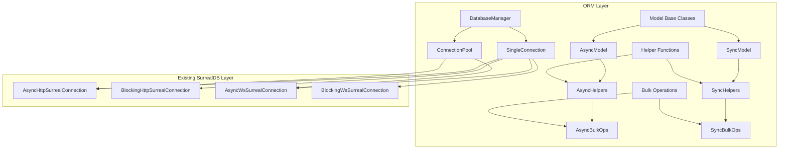

# SurrealDB Python ORM Helpers - Architectural Design

## Overview

This design provides a hybrid approach with both model-based classes and standalone helper functions, featuring lightweight type hints without runtime validation, and supporting both connection pooling and single connection management.

## Architecture Diagram



## Design Principles

- **KISS (Keep It Simple, Stupid)**: Simple, intuitive interfaces
- **DRY (Don't Repeat Yourself)**: Reusable components and patterns
- **One Class Per File**: Clear separation of concerns
- **Lightweight**: Minimal overhead over existing SurrealDB client
- **Type Safety**: Comprehensive type hints without runtime validation
- **Compatibility**: Full integration with existing SurrealDB architecture

## File Structure

```
src/surrealdb/orm/
├── __init__.py
├── connection/
│   ├── __init__.py
│   ├── manager.py          # DatabaseManager
│   ├── pool.py             # ConnectionPool
│   └── single.py           # SingleConnectionWrapper
├── models/
│   ├── __init__.py
│   ├── base.py             # BaseModel, AsyncModel, SyncModel
│   ├── fields.py           # Field type definitions
│   └── meta.py             # Model metaclass
├── helpers/
│   ├── __init__.py
│   ├── async_helpers.py    # AsyncCRUDHelpers
│   ├── sync_helpers.py     # SyncCRUDHelpers
│   └── base_helpers.py     # Common helper functionality
├── bulk/
│   ├── __init__.py
│   ├── async_bulk.py       # AsyncBulkOperations
│   ├── sync_bulk.py        # SyncBulkOperations
│   └── batch.py            # Batch operation utilities
├── exceptions.py           # ORM-specific exceptions
└── types.py               # Type definitions and aliases
```

## Core Components Design

### 1. Database Connection Management

#### DatabaseManager (`src/surrealdb/orm/connection/manager.py`)

```python
class DatabaseManager:
    """Main entry point for ORM operations with connection management."""
    
    def __init__(
        self,
        url: str,
        namespace: str,
        database: str,
        auth_params: Optional[Dict[str, Any]] = None,
        pool_size: int = 10,
        use_pool: bool = True
    ) -> None
    
    async def get_connection(self) -> Union[ConnectionPool, SingleConnectionWrapper]
    async def close(self) -> None
    def get_sync_connection(self) -> Union[ConnectionPool, SingleConnectionWrapper]
    def close_sync(self) -> None
```

**Key Features:**
- Automatic connection type detection (HTTP/WebSocket)
- Built-in authentication handling
- Configurable connection pooling
- Support for both async and sync operations

#### ConnectionPool (`src/surrealdb/orm/connection/pool.py`)

```python
class AsyncConnectionPool:
    """Async connection pool for SurrealDB connections."""
    
    def __init__(
        self,
        url: str,
        namespace: str,
        database: str,
        auth_params: Optional[Dict[str, Any]] = None,
        pool_size: int = 10,
        max_retries: int = 3
    ) -> None
    
    async def acquire(self) -> AsyncHttpSurrealConnection
    async def release(self, connection: AsyncHttpSurrealConnection) -> None
    async def execute_with_connection(self, operation: Callable) -> Any
    async def close_all(self) -> None

class SyncConnectionPool:
    """Sync connection pool for SurrealDB connections."""
    # Similar interface but synchronous
```

**Key Features:**
- Connection lifecycle management
- Automatic connection health checks
- Configurable pool size and retry logic
- Context manager support for safe connection handling

#### SingleConnectionWrapper (`src/surrealdb/orm/connection/single.py`)

```python
class AsyncSingleConnection:
    """Wrapper for single async connection with retry logic."""
    
    def __init__(
        self,
        connection: Union[AsyncHttpSurrealConnection, AsyncWsSurrealConnection],
        max_retries: int = 3
    ) -> None
    
    async def execute_with_retry(self, operation: Callable) -> Any
    async def ensure_connected(self) -> None
    async def close(self) -> None

class SyncSingleConnection:
    """Wrapper for single sync connection with retry logic."""
    # Similar interface but synchronous
```

**Key Features:**
- Wraps existing SurrealDB connections
- Automatic retry logic with exponential backoff
- Connection state monitoring
- Graceful error handling

### 2. Model-Based Interface

#### BaseModel (`src/surrealdb/orm/models/base.py`)

```python
class ModelMeta(type):
    """Metaclass for model creation and field processing."""
    
    def __new__(cls, name, bases, attrs):
        # Process field definitions
        # Set up table name
        # Create field mappings

class BaseModel(metaclass=ModelMeta):
    """Base model class with common functionality."""
    
    table_name: str
    _fields: Dict[str, Field]
    _connection: Optional[Union[ConnectionPool, SingleConnectionWrapper]]
    
    def __init__(self, **kwargs) -> None
    def to_dict(self) -> Dict[str, Any]
    def from_dict(self, data: Dict[str, Any]) -> 'BaseModel'
    
    @classmethod
    def set_connection(cls, connection: Union[ConnectionPool, SingleConnectionWrapper]) -> None

class AsyncModel(BaseModel):
    """Async model with database operations."""
    
    async def save(self) -> 'AsyncModel'
    async def delete(self) -> bool
    async def refresh(self) -> 'AsyncModel'
    
    @classmethod
    async def create(cls, **kwargs) -> 'AsyncModel'
    @classmethod
    async def get(cls, record_id: Union[str, RecordID]) -> Optional['AsyncModel']
    @classmethod
    async def filter(cls, **kwargs) -> List['AsyncModel']
    @classmethod
    async def all(cls) -> List['AsyncModel']
    @classmethod
    async def update_many(cls, filter_kwargs: Dict, update_data: Dict) -> int
    @classmethod
    async def delete_many(cls, **filter_kwargs) -> int

class SyncModel(BaseModel):
    """Sync model with database operations."""
    # Similar interface but synchronous
```

**Key Features:**
- Metaclass-based field processing
- Automatic table name inference
- Rich query interface with filtering
- Batch operations support
- Connection management integration

#### Field Types (`src/surrealdb/orm/models/fields.py`)

```python
class Field:
    """Base field class."""
    
    def __init__(
        self,
        default: Any = None,
        required: bool = False,
        description: Optional[str] = None
    ) -> None

class StringField(Field):
    """String field type."""
    
    def __init__(self, max_length: Optional[int] = None, **kwargs) -> None

class IntField(Field):
    """Integer field type."""

class FloatField(Field):
    """Float field type."""

class BoolField(Field):
    """Boolean field type."""

class DateTimeField(Field):
    """DateTime field type."""
    
    def __init__(self, auto_now: bool = False, auto_now_add: bool = False, **kwargs) -> None

class RecordIDField(Field):
    """RecordID field type."""
    
    def __init__(self, table: Optional[str] = None, **kwargs) -> None

class ListField(Field):
    """List field type."""
    
    def __init__(self, item_type: Optional[Type] = None, **kwargs) -> None

class DictField(Field):
    """Dictionary field type."""
```

**Key Features:**
- Type-specific field classes
- Automatic value conversion
- Default value handling
- Relationship field support
- SurrealDB-specific types (RecordID, etc.)

### 3. Helper Functions

#### AsyncCRUDHelpers (`src/surrealdb/orm/helpers/async_helpers.py`)

```python
class AsyncCRUDHelpers:
    """Async CRUD helper functions."""
    
    def __init__(self, connection: Union[ConnectionPool, SingleConnectionWrapper]) -> None
    
    async def insert_one(
        self,
        table: Union[str, Table],
        data: Dict[str, Any]
    ) -> Dict[str, Any]
    
    async def insert_many(
        self,
        table: Union[str, Table],
        data: List[Dict[str, Any]]
    ) -> List[Dict[str, Any]]
    
    async def update_one(
        self,
        record_id: Union[str, RecordID],
        data: Dict[str, Any],
        merge: bool = False
    ) -> Optional[Dict[str, Any]]
    
    async def update_many(
        self,
        table: Union[str, Table],
        filter_query: str,
        data: Dict[str, Any],
        merge: bool = False
    ) -> List[Dict[str, Any]]
    
    async def upsert_one(
        self,
        record_id: Union[str, RecordID],
        data: Dict[str, Any]
    ) -> Dict[str, Any]
    
    async def upsert_many(
        self,
        table: Union[str, Table],
        data: List[Dict[str, Any]],
        key_field: str = "id"
    ) -> List[Dict[str, Any]]
    
    async def delete_one(
        self,
        record_id: Union[str, RecordID]
    ) -> bool
    
    async def delete_many(
        self,
        table: Union[str, Table],
        filter_query: str
    ) -> int
    
    async def select_one(
        self,
        record_id: Union[str, RecordID]
    ) -> Optional[Dict[str, Any]]
    
    async def select_many(
        self,
        table: Union[str, Table],
        filter_query: Optional[str] = None,
        limit: Optional[int] = None,
        offset: Optional[int] = None
    ) -> List[Dict[str, Any]]
    
    async def count(
        self,
        table: Union[str, Table],
        filter_query: Optional[str] = None
    ) -> int
    
    async def exists(
        self,
        record_id: Union[str, RecordID]
    ) -> bool

class SyncCRUDHelpers:
    """Sync CRUD helper functions."""
    # Similar interface but synchronous
```

**Key Features:**
- Comprehensive CRUD operations
- Flexible filtering and querying
- Pagination support
- Existence checking utilities
- Merge vs replace update options

### 4. Bulk Operations

#### AsyncBulkOperations (`src/surrealdb/orm/bulk/async_bulk.py`)

```python
class AsyncBulkOperations:
    """Async bulk operations with batching and error handling."""
    
    def __init__(
        self,
        connection: Union[ConnectionPool, SingleConnectionWrapper],
        batch_size: int = 1000,
        max_retries: int = 3
    ) -> None
    
    async def bulk_insert(
        self,
        table: Union[str, Table],
        data: List[Dict[str, Any]],
        ignore_errors: bool = False
    ) -> BulkResult
    
    async def bulk_update(
        self,
        updates: List[BulkUpdateItem],
        ignore_errors: bool = False
    ) -> BulkResult
    
    async def bulk_upsert(
        self,
        table: Union[str, Table],
        data: List[Dict[str, Any]],
        key_field: str = "id",
        ignore_errors: bool = False
    ) -> BulkResult
    
    async def bulk_delete(
        self,
        record_ids: List[Union[str, RecordID]],
        ignore_errors: bool = False
    ) -> BulkResult
    
    async def bulk_query(
        self,
        queries: List[str],
        ignore_errors: bool = False
    ) -> List[Any]

class SyncBulkOperations:
    """Sync bulk operations."""
    # Similar interface but synchronous
```

**Key Features:**
- Configurable batch sizing
- Comprehensive error handling and reporting
- Progress tracking capabilities
- Transaction-like behavior options
- Performance optimization for large datasets

### 5. Type Definitions and Utilities

#### Types (`src/surrealdb/orm/types.py`)

```python
from typing import TypeVar, Union, Dict, List, Any, Optional
from dataclasses import dataclass

T = TypeVar('T', bound='BaseModel')

@dataclass
class BulkUpdateItem:
    record_id: Union[str, RecordID]
    data: Dict[str, Any]
    merge: bool = False

@dataclass
class BulkResult:
    success_count: int
    error_count: int
    errors: List[Dict[str, Any]]
    results: List[Any]

ConnectionType = Union[
    AsyncHttpSurrealConnection,
    BlockingHttpSurrealConnection,
    AsyncWsSurrealConnection,
    BlockingWsSurrealConnection
]

PoolType = Union[AsyncConnectionPool, SyncConnectionPool]
WrapperType = Union[AsyncSingleConnection, SyncSingleConnection]
```

#### Exceptions (`src/surrealdb/orm/exceptions.py`)

```python
class SurrealORMError(Exception):
    """Base exception for ORM operations."""

class ConnectionError(SurrealORMError):
    """Connection-related errors."""

class ModelError(SurrealORMError):
    """Model-related errors."""

class ValidationError(SurrealORMError):
    """Data validation errors."""

class BulkOperationError(SurrealORMError):
    """Bulk operation errors."""
    
    def __init__(self, message: str, errors: List[Dict[str, Any]]) -> None:
        super().__init__(message)
        self.errors = errors
```

## Usage Examples

### Model-Based Usage

```python
from surrealdb.orm import DatabaseManager, AsyncModel, StringField, IntField, DateTimeField

# Setup connection
db_manager = DatabaseManager(
    url="http://localhost:8000",
    namespace="test",
    database="test",
    auth_params={"username": "root", "password": "root"}
)

# Define model
class User(AsyncModel):
    table_name = "users"
    
    name = StringField(required=True)
    email = StringField(required=True)
    age = IntField()
    created_at = DateTimeField(auto_now_add=True)

# Set connection
User.set_connection(await db_manager.get_connection())

# Use model
user = await User.create(name="John", email="john@example.com", age=30)
users = await User.filter(age__gte=18)
user.age = 31
await user.save()
```

### Helper Functions Usage

```python
from surrealdb.orm import AsyncCRUDHelpers

helpers = AsyncCRUDHelpers(await db_manager.get_connection())

# Insert operations
user = await helpers.insert_one("users", {"name": "Jane", "email": "jane@example.com"})
users = await helpers.insert_many("users", [
    {"name": "Bob", "email": "bob@example.com"},
    {"name": "Alice", "email": "alice@example.com"}
])

# Update operations
updated_user = await helpers.update_one("users:123", {"age": 25})
updated_count = await helpers.update_many("users", "age < 18", {"status": "minor"})

# Bulk operations
bulk_ops = AsyncBulkOperations(await db_manager.get_connection())
result = await bulk_ops.bulk_insert("users", large_user_list)
```

### Single Connection Usage

```python
from surrealdb import AsyncSurreal
from surrealdb.orm import AsyncSingleConnection, AsyncCRUDHelpers

# Use existing connection
conn = AsyncSurreal("http://localhost:8000")
await conn.signin({"username": "root", "password": "root"})
await conn.use("test", "test")

# Wrap in ORM helper
wrapped_conn = AsyncSingleConnection(conn)
helpers = AsyncCRUDHelpers(wrapped_conn)

# Use helpers with existing connection
users = await helpers.select_many("users", limit=10)
```

## Integration Points

### 1. Error Handling Integration
- Wraps existing `UtilsMixin.check_response_for_error()` 
- Extends `SurrealDBMethodError` with ORM-specific exceptions
- Provides detailed error context for bulk operations

### 2. Data Type Integration
- Full compatibility with existing `RecordID` and `Table` classes
- Leverages existing CBOR encoding/decoding
- Supports all existing SurrealDB data types

### 3. Connection Integration
- Works with all existing connection types (HTTP/WS, Async/Sync)
- Maintains existing authentication and namespace/database selection
- Preserves existing connection lifecycle management

## Performance Considerations

### Connection Pooling
- Configurable pool sizes based on application needs
- Connection health monitoring and automatic replacement
- Efficient connection reuse to minimize overhead

### Bulk Operations
- Intelligent batching to optimize network usage
- Parallel processing where appropriate
- Memory-efficient streaming for large datasets

### Query Optimization
- Query result caching where beneficial
- Lazy loading for related data
- Efficient pagination implementation

## Documentation Structure

```
docs/orm/
├── getting-started.md
├── models/
│   ├── defining-models.md
│   ├── field-types.md
│   └── model-operations.md
├── helpers/
│   ├── crud-helpers.md
│   └── bulk-operations.md
├── connections/
│   ├── connection-management.md
│   └── pooling.md
├── examples/
│   ├── basic-usage.md
│   ├── advanced-patterns.md
│   └── migration-guide.md
└── api-reference/
    ├── models.md
    ├── helpers.md
    └── connections.md
```

## Implementation Phases

### Phase 1: Core Infrastructure
1. Connection management (manager, pool, single wrapper)
2. Base exceptions and type definitions
3. Basic helper functions

### Phase 2: Model System
1. Field definitions and metaclass
2. Base model classes
3. Model operations (CRUD)

### Phase 3: Bulk Operations
1. Bulk operation classes
2. Batching and error handling
3. Performance optimization

### Phase 4: Documentation and Testing
1. Comprehensive test suite
2. Documentation and examples
3. Performance benchmarks

This architecture provides a comprehensive ORM layer that enhances the existing SurrealDB Python client while maintaining full compatibility and following the specified design constraints. The hybrid approach offers both high-level model abstractions and low-level helper functions, with flexible connection management supporting both pooling and single connections.